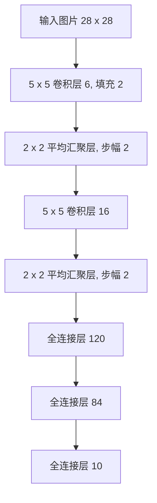

[TOC]


# 数学符号

| 类别             | 符号                              | 说明                                |
| ---------------- | --------------------------------- | ----------------------------------- |
| **数字**         | $$x$$                             | 标量                                |
|                  | $$\mathbf{x}$$                    | 向量                                |
|                  | $$X$$                             | 矩阵                                |
|                  | $$\mathcal{X}$$                   | 张量                                |
|                  | $$I$$                             | 单位矩阵                            |
|                  | $$x_i$$                           | 向量第$$i$$个元素                   |
|                  | $$X_{ij}$$                        | 矩阵$$X$$的第$$i$$行第$$j$$列的元素 |
| **集合论**       | $$\mathcal{X}$$                   | 集合                                |
|                  | $$\mathbb{Z}$$                    | 整数集合                            |
|                  | $$\mathbb{R}$$                    | 实数集合                            |
|                  | $$\mathbb{R}^n$$                  | $$n$$维实数向量集                   |
|                  | $$\mathbb{R}^{m \times n}$$       | $$m$$行$$n$$列的实数矩阵集合        |
|                  | $$A \cup B$$                      | 集合$$A$$和集合$$B$$的并集          |
|                  | $$A \cap B$$                      | 集合$$A$$和集合$$B$$的交集          |
|                  | $$A \setminus B$$                 | 集合$$A$$与集合$$B$$的相对补集      |
| **函数和运算符** | $$f(\cdot)$$                      | 函数                                |
|                  | $$\log(\cdot)$$                   | 自然对数                            |
|                  | $$\exp(\cdot)$$                   | 指数函数                            |
|                  | $$\mathbf{1}_{\{x\}}$$            | 指示函数                            |
|                  | $$(\cdot)^T$$                     | 向量或矩阵的转置                    |
|                  | $$X^{-1}$$                        | 矩阵的逆                            |
|                  | $$\odot$$                         | 按元素相乘                          |
|                  | $$[ \cdot, \cdot ]$$              | 连结                                |
|                  | $$|\mathcal{X}|$$                 | 集合的基数                          |
|                  | $$\| \cdot \|_p$$                 | $$L_p$$ 正则                        |
|                  | $$\| \cdot \|_2$$                 | $$L_2$$ 正则                        |
|                  | $$\langle x, y \rangle$$          | 向量$$x$$和$$y$$的点积              |
|                  | $$\sum$$                          | 连加                                |
|                  | $$\prod$$                         | 连乘                                |
|                  | $$\operatorname{def}$$            | 定义                                |
| **微积分**       | $$\frac{dz}{dx}$$                 | $$z$$关于$$x$$的导数                |
|                  | $$\frac{\partial z}{\partial x}$$ | $$z$$关于$$x$$的偏导数              |
|                  | $$\nabla_{\mathbf{x}} y$$         | $$y$$关于$$\mathbf{x}$$的梯度       |
|                  | $$\int_a^b f(x) \, dx$$           | $$f(x)$$在$$[a, b]$$上的定积分      |
|                  | $$\int f(x) \, dx$$               | $$f(x)$$的未定积分                  |
| **概率与信息论** | $$P(x)$$                          | 概率分布                            |
|                  | $$x \sim P$$                      | 随机变量$$x$$具有概率分布$$P$$      |
|                  | $$P(X | Y)$$                      | $$Y$$条件下$$X$$的条件概率          |
|                  | $$p(x)$$                          | 概率密度函数                        |
|                  | $$\mathbb{E}[x]$$                 | 函数$$x$$的数学期望                 |
|                  | $$X \perp Y$$                     | 随机变量$$X$$和$$Y$$独立            |
|                  | $$X \perp Y | Z$$                 | $$Z$$条件下$$X$$和$$Y$$独立         |
|                  | $$\operatorname{Var}(X)$$         | 随机变量$$X$$的方差                 |
|                  | $$\sigma_X$$                      | 随机变量$$X$$的标准差               |
|                  | $$\operatorname{Cov}(X, Y)$$      | 随机变量$$X$$和$$Y$$的协方差        |
|                  | $$\rho(X, Y)$$                    | 随机变量$$X$$和$$Y$$的相关性        |
|                  | $$H(X)$$                          | 随机变量$$X$$的熵                   |
|                  | $$D_{KL}(P \| Q)$$                | 分布$$P$$和$$Q$$的KL-散度           |
| **复杂度**       | $$O(\cdot)$$                      | 大O标记                             |


# 1 预备知识

## 1.1 数据操作

<font color=blue>**1、张量**</font>

在处理深度学习任务时，我们需要有效地创建和操作数据张量（tensor）。通常，这些张量代表模型的输入、输出或中间特征。为了简化操作，我们可以借助诸如 MXNet、NumPy 等库来处理这些数据张量。

在这个部分，我们主要使用 MXNet 的 `np` 和 `npx` 模块来完成数据操作的示例。默认情况下，张量会分配在 CPU 上。

```python
from mxnet import np, npx
npx.set_np()
```

**创建张量**

我们可以使用 `np.arange` 来生成一个包含一系列数字的张量。例如，生成一个包含从 0 到 11 的数组：

```
x = np.arange(12)

array([ 0.,  1.,  2.,  3.,  4.,  5.,  6.,  7.,  8.,  9., 10., 11.])
```

**创建特定元素的张量**

- 使用 `np.zeros` 创建一个所有元素为 0 的张量。
- 使用 `np.ones` 创建一个所有元素为 1 的张量。

```
np.zeros((2, 3, 4))

array([[[0., 0., 0., 0.],
        [0., 0., 0., 0.],
        [0., 0., 0., 0.]],

       [[0., 0., 0., 0.],
        [0., 0., 0., 0.],
        [0., 0., 0., 0.]]])
```

**随机分布张量**

使用 `np.random.normal` 创建一个符合正态分布的随机数组，并指定形状：

```
np.random.normal(0, 1, size=(2, 3, 4))

array([[[ 2.2122644 ,  1.8368068 ,  0.7740388 ,  0.4838468 ],
        [ 0.0832195 ,  2.0895436 ,  1.0892124 ,  1.5573911 ],
        [ 1.8971144 ,  1.1681848 ,  1.4387643 ,  1.5508711 ]]])
```

<font color=blue>**2、广播机制**</font>

广播即在不同形状的张量之间如何按元素执行操作。这种机制的工作方式包括以下两个步骤：

1. 通过适当复制元素来扩展一个或多个数组，使它们在转换后具有相同的形状。
2. 对生成的数组执行按元素操作。

```
a = np.arange(3).reshape(3, 1)
b = np.arange(2).reshape(1, 2)

array([[0.],
       [1.],
       [2.]]),
array([[0., 1.]])
```

广播机制会扩展元素：

- `a` 是一个 3x1 的数组，广播机制会在列方向上复制它的元素，使其形状变成 3x2：

```
a = array([[0., 0.],
           [1., 1.],
           [2., 2.]])
```

- `b` 是一个 1x2 的数组，广播机制会在行方向上复制它的元素，使其形状变成 3x2：

```
b = array([[0., 1.],
           [0., 1.],
           [0., 1.]])
```

结果如下：

```
a + b

array([[0., 1.],
       [1., 2.],
       [2., 3.]])
```

<font color=blue>**3、索引和切片**</font>

与 Python 数组的操作类似，可以通过索引访问和修改张量中的元素。

**索引访问元素**：

可以使用索引访问单个元素或多个元素的切片。例如：

```
X = np.arange(12).reshape(3, 4)
X[-1]         # 选择最后一行
X[1:3]        # 选择第二行和第三行

(array([ 8., 9., 10., 11.]),
 array([[ 4., 5., 6., 7.],
       [ 8., 9., 10., 11.]]))
```

**通过指定索引来将元素写入矩阵**

```
X[1, 2] = 9
```

**多个元素赋值**

例如，将 `X` 的前两行的所有元素赋值为 12

```
X[0:2, :] = 12  # “:”代表沿轴1（列）的所有元素
```

<font color=blue>**4、节省内存**</font>

- 某些操作会导致新建内存分配。例如，当执行 `Y = X + Y` 时，会生成一个新的内存空间给结果，而不再复用 `Y` 的原内存位置。
- 可以使用 `id()` 函数查看对象的内存地址，判断内存是否发生了重新分配。

```
before = id(Y)
Y = Y + X
id(Y) == before

False
```

**原地操作**：

使用切片赋值可以避免新分配内存。例如下面代码执行后，`Z` 的内存地址不变。

```
Z = np.zeros_like(Y)
Z[:] = X + Y
```

还可以使用 `X[:] = X + Y` 或 `X += Y` 来进行原地操作，避免额外内存分配。`X += Y` 的操作会在 `X` 本身上进行修改，保持内存位置不变。

<font color=blue>**4、转换为其他Python对象**</font>

可以将深度学习框架的张量（如 MXNet 张量）转换为 NumPy 数组，或将 NumPy 数组转换为 MXNet 张量，二者的转换很方便，但不会共享内存。

```
A = X.asnumpy()
B = np.array(A)
type(A), type(B)  # (numpy.ndarray, mxnet.numpy.ndarray)
```

要将大小为 1 的张量转换为 Python 标量，可以使用 `.item()` 方法或内置函数如 `float()` 和 `int()`。

```
a = np.array([3.5])
a, a.item(), float(a), int(a)

(array([3.5]), 3.5, 3.5, 3)
```

## 1.2 数据预处理

为了能用深度学习来解决现实世界的问题，我们通常需要从预处理原始数据开始。这里介绍了使用 Python 和 Pandas 的一些基本数据预处理方法。Pandas 是一个强大的数据分析工具库，能够方便地处理各种结构化数据。

**读取数据集**

首先，我们创建一个示例数据集并将其保存为 CSV 文件。

```python
import os
os.makedirs(os.path.join('.', 'data'), exist_ok=True)
data_file = os.path.join('data', 'house_tiny.csv')
with open(data_file, 'w') as f:
    f.write('NumRooms,Alley,Price\n')  # 列名
    f.write('NA,Pave,127500\n')        # 每行表示一个数据样本
    f.write('2.0,NA,106000\n')
    f.write('4.0,NA,178100\n')
    f.write('NA,NA,140000\n')
```

然后，用 Pandas 读取这个 CSV 文件并显示内容：

```
import pandas as pd
data = pd.read_csv(data_file)
print(data)

   NumRooms Alley   Price
0       NaN  Pave  127500
1       2.0   NaN  106000
2       4.0   NaN  178100
3       NaN   NaN  140000
```

**处理缺失值**

数据集中有些值缺失（以 “NaN” 表示），可以选择插值或删除缺失值。这里我们通过插值方式处理缺失值。

通过位置索引iloc，我们将data分成inputs和outputs，其中前者为data的前两列，而后者为data的最后一列。对于inputs中缺少的数值，我们用同一列的均值替换“NaN”项。

```
inputs, outputs = data.iloc[:, 0:2], data.iloc[:, 2]
inputs = inputs.fillna(inputs.mean())
print(inputs)

  NumRooms Alley
0 3.0      Pave
1 2.0      NaN
2 4.0      NaN
3 3.0      NaN
```

对于inputs中的类别值或离散值，我们将“NaN”视为一个类别。由于“巷子类型”（“Alley”）列只接受两种类型的类别值“Pave”和“NaN”，pandas可以自动将此列转换为两列“Alley_Pave”和“Alley_nan”

```
inputs = pd.get_dummies(inputs, dummy_na=True)
print(inputs)

   NumRooms  Alley_Pave  Alley_nan
0       3.0           1          0
1       2.0           0          1
2       4.0           0          1
3       3.0           0          1
```

**转换为张量格式**

为了方便后续的深度学习处理，将 Pandas 数据转换为张量格式。

```
from mxnet import np
X, y = np.array(inputs.to_numpy(dtype=float)), np.array(outputs.to_numpy(dtype=float))

(array([[3., 1., 0.],
        [2., 0., 1.],
        [4., 0., 1.],
        [3., 0., 1.]], dtype=float64),
 array([127500., 106000., 178100., 140000.], dtype=float64))
```

## 1.3 线性代数

**标量**

标量由只有一个元素的张量表示。下面的代码将实例化两个标量，并执行一些熟悉的算术运算，即加法、乘法、除法和指数。

```
from mxnet import np, npx
npx.set_np()
x = np.array(3.0)
y = np.array(2.0)
x + y, x * y, x / y, x ** y

(array(5.), array(6.), array(1.5), array(9.))
```

**向量**

向量可以被视为标量值组成的列表。

```
x = np.arange(4)

array([0., 1., 2., 3.])
```

**矩阵**

正如向量将标量从零阶推广到一阶，矩阵将向量从一阶推广到二阶。

```
A = np.arange(20).reshape(5, 4)

array([[ 0., 1., 2., 3.],
      [ 4., 5., 6., 7.],
      [ 8., 9., 10., 11.],
      [12., 13., 14., 15.],
      [16., 17., 18., 19.]])
```

转置矩阵为：`A.T`

**张量**

(1)二元运算

例：将两个相同形状的矩阵相加，会在这两个矩阵上执行元素加法

```
A = np.arange(20).reshape(5, 4)
B = A.copy() # 通过分配新内存，将A的一个副本分配给B
A, A + B
```

(2)求和

```
x = np.arange(4)
x, x.sum()

(array([0., 1., 2., 3.]), array(6.))
```

**降维**

调用求和函数会沿所有的轴降低张量的维度，使它变为一个标量。我们还可以指定张量沿哪一个轴来通过求和降低维度。

```
A_sum_axis0 = A.sum(axis=0)
A_sum_axis0, A_sum_axis0.shape

(array([40., 45., 50., 55.]), (4,))
```

沿着行和列对矩阵求和，等价于对矩阵的所有元素进行求和。

```
A.sum(axis=[0, 1]) # 结果和A.sum()相同

array(190.)
```

一个与求和相关的量是平均值：

```
A.mean(), A.sum() / A.size

(array(9.5), array(9.5))
```

同样，计算平均值的函数也可以沿指定轴降低张量的维度。

```
A.mean(axis=0), A.sum(axis=0) / A.shape[0]

(array([ 8., 9., 10., 11.]), array([ 8., 9., 10., 11.]))
```

**非降维求和**

但是，有时在调用函数来计算总和或均值时保持轴数不变会很有用

```
sum_A = A.sum(axis=1, keepdims=True)
sum_A

array([[ 6.],
    [22.],
    [38.],
    [54.],
    [70.]])
```

例如，由于sum_A在对每行进行求和后仍保持两个轴，我们可以通过广播将A除以sum_A。

```
A / sum_A

array([[0. , 0.16666667, 0.33333334, 0.5 ],
[0.18181819, 0.22727273, 0.27272728, 0.3181818 ],
[0.21052632, 0.23684211, 0.2631579 , 0.28947368],
[0.22222222, 0.24074075, 0.25925925, 0.2777778 ],
[0.22857143, 0.24285714, 0.25714287, 0.27142859]])
```

如果我们想沿某个轴计算A元素的累积总和，比如axis=0（按行计算），可以调用cumsum函数。此函数不会沿任何轴降低输入张量的维度。

```
A.cumsum(axis=0)

array([[ 0., 1., 2., 3.],
    [ 4., 6., 8., 10.],
    [12., 15., 18., 21.],
    [24., 28., 32., 36.],
    [40., 45., 50., 55.]])
```

**点积/向量积/矩阵乘法**

这三个都是用dot函数实现的。最简单的点积是相同位置的按元素乘积的和：

```
y = np.ones(4)
x, y, np.dot(x, y)

(array([0., 1., 2., 3.]), array([1., 1., 1., 1.]), array(6.))
```

注意，我们可以通过执行按元素乘法，然后进行求和来表示两个向量的点积：

```
np.sum(x * y)

array(6.)
```

**范数**

**范数**（norm）是用于衡量向量或矩阵大小的一种方法。范数可以理解为向量的“长度”或矩阵的“幅度”。不同的范数适用于不同的情况，常用的范数主要包括以下几种：

1. **L1 范数**（曼哈顿范数）：向量中各元素绝对值的和，通常用于稀疏性约束问题。
   $$\|x\|_1 = |x_1| + |x_2| + \dots + |x_n|$$

2. **L2 范数**（欧几里得范数）：向量中各元素平方和的平方根，即向量的“长度”。
   $$\|x\|_2 = \sqrt{x_1^2 + x_2^2 + \dots + x_n^2}$$

3. **无穷范数**（L∞ 范数）：向量中元素的最大绝对值，常用于优化问题中的约束。
   $$\|x\|_{\infty} = \max(|x_1|, |x_2|, \dots, |x_n|)$$

范数的作用如下：

- 正则化：通过 L1 或 L2 范数限制模型权重，防止过拟合，提升模型的泛化能力。
- 梯度剪裁：使用 L2 范数限制梯度的大小，避免梯度爆炸问题，特别是在深层网络中。
- 特征归一化：利用范数将向量标准化，方便模型更稳定地学习。
- 损失函数：L1 和 L2 范数用于设计不同的损失函数（如 MAE 和 MSE），适用于不同类型的回归任务。

我们可以使用 `numpy` 的 `linalg.norm` 函数来计算这些范数：

```python
import numpy as np

# 定义一个向量
x = np.array([3, 4])

# 计算 L1 范数
l1_norm = np.linalg.norm(x, ord=1)
print("L1 范数:", l1_norm)  # 输出: 7

# 计算 L2 范数
l2_norm = np.linalg.norm(x, ord=2)
print("L2 范数:", l2_norm)  # 输出: 5.0

# 计算无穷范数
inf_norm = np.linalg.norm(x, ord=np.inf)
print("无穷范数:", inf_norm)  # 输出: 4
```

## 1.4 自动微分

深度学习框架通过自动计算导数，即自动微分来加快求导。实际中，根据设计好的模型，系统会构建一个计算图，来跟踪计算是哪些数据通过哪些操作组合起来产生输出。自动微分使系统能够随后反向传播梯度。

- 反向传播意味着跟踪整个计算图，填充关于每个参数的偏导数。

**例子：**

在深度学习中，计算函数的梯度是优化和模型训练的关键步骤。MXNet 提供了自动微分模块 `autograd` 来帮助我们自动计算梯度。

```
from mxnet import autograd, np, npx
npx.set_np()

x = np.arange(4.0)  # 创建变量x并为其分配一个初始值

array([0., 1., 2., 3.])
```

在计算关于 x 的梯度之前，我们需要为  x 分配一个地方来存储梯度。可以通过调用 `attach_grad()` 方法来为张量分配梯度存储

```
# 通过调用attach_grad来为一个张量的梯度分配内存
x.attach_grad()
# 在计算关于x的梯度后，将能够通过'grad'属性访问它，它的值被初始化为0
x.grad

array([0., 0., 0., 0.])
```

使用 `autograd.record()` 来构建计算图。在此上下文中，我们可以定义函数并计算输出，例如：

```
with autograd.record():
    y = 2 * np.dot(x, x)
```

接下来，通过调用反向传播函数来自动计算y关于x每个分量的梯度。

```
y.backward()
```

## 1.5 Python知识

### 1.5.1 计算图

**计算图**（Computation Graph）是一种**有向图结构**，用来表示计算过程中各个操作和数据之间的关系。通过构建计算图，我们可以跟踪整个计算过程，为反向传播（backpropagation）计算梯度提供依据。

计算图是一种**节点和边的有向图**，其中：

- **节点**：表示计算过程中的**操作**（例如加法、乘法、激活函数）或**变量**（输入数据、参数、临时结果）。
- **边**：表示数据在操作之间的流动，反映了变量之间的依赖关系。

在前向传播过程中，每一步计算都会生成一个新的节点，这些节点之间的关系会被记录下来，形成一个计算图。计算图为后续的**自动求导**提供了基础，因为反向传播依赖于这个图来逐步计算梯度。

<font color=blue>**作用**</font>

计算图的核心作用是帮助实现**反向传播算法**，从而自动计算模型参数的梯度。具体过程如下：

1. **前向传播**：从输入到输出按照计算图的顺序依次计算，每一步都记录操作及其依赖关系。
2. **反向传播**：根据计算图中的依赖关系，使用链式法则逐层计算各个参数的梯度。

计算图让我们能够自动追踪计算过程中每一步的梯度，而不需要手动推导复杂的数学公式。

<font color=blue>**例子**</font>

假设我们有以下公式：

$$
z = (x + y) \times w
$$

这里，我们有三个变量：`x`、`y` 和 `w`。假设这些变量有如下数值：

- $$ x = 2 $$，$$ y = 3 $$，$$ w = 4 $$

根据公式 $$ z = (x + y) \times w $$，我们可以拆解计算过程：

1. 计算 $$ q = x + y $$，得到 $$ q = 2 + 3 = 5 $$。
2. 计算 $$ z = q \times w $$，得到 $$ z = 5 \times 4 = 20 $$。

**问题：如何计算每个变量对输出 $$ z $$ 的影响？**

假设我们想知道，如果 `x`、`y` 或 `w` 的值发生一点变化，输出 `z` 会受到多大影响。这就是 **梯度** 的作用，反向传播可以帮助我们计算这些梯度。

**反向传播**

反向传播的目标是**计算每个变量的梯度**，即：
- $$ \frac{\partial z}{\partial x} $$：`x` 对 `z` 的影响；$$ \frac{\partial z}{\partial y} $$：`y` 对 `z` 的影响；$$ \frac{\partial z}{\partial w} $$：`w` 对 `z` 的影响

我们使用 **链式法则**（Chain Rule）从输出 `z` 逐步回溯计算每个变量的梯度。

**具体计算步骤**

(1)计算 $$ \frac{\partial z}{\partial q} $$

因为 $$ z = q \times w $$，对 `q` 求偏导数：

$$
\frac{\partial z}{\partial q} = w = 4
$$

这表示 `q` 每增加 1，`z` 将增加 4。

(2)计算 $$ \frac{\partial z}{\partial w} $$

继续计算 `w` 对 `z` 的影响，因为 $$ z = q \times w $$，对 `w` 求偏导数：

$$
\frac{\partial z}{\partial w} = q = 5
$$

这表示 `w` 每增加 1，`z` 将增加 5。

(3)计算 $$ \frac{\partial z}{\partial x} $$ 和 $$ \frac{\partial z}{\partial y} $$

因为 $$ q = x + y $$，我们可以对 `x` 和 `y` 分别求偏导数：

$$
\frac{\partial q}{\partial x} = 1
$$
$$
\frac{\partial q}{\partial y} = 1
$$

接着利用链式法则，我们可以得到 `x` 和 `y` 对 `z` 的影响：

$$
\frac{\partial z}{\partial x} = \frac{\partial z}{\partial q} \times \frac{\partial q}{\partial x} = 4 \times 1 = 4
$$
$$
\frac{\partial z}{\partial y} = \frac{\partial z}{\partial q} \times \frac{\partial q}{\partial y} = 4 \times 1 = 4
$$

通过反向传播，我们得到了每个变量的梯度：

- $$ \frac{\partial z}{\partial x} = 4 $$，$$ \frac{\partial z}{\partial y} = 4 $$，$$ \frac{\partial z}{\partial w} = 5 $$

这些梯度告诉我们：
- `x` 和 `y` 每增加 1，`z` 会增加 4。
- `w` 每增加 1，`z` 会增加 5。

**反向传播的意义**

- 反向传播帮助我们**计算每个变量的梯度**，这是优化模型参数的关键。
- 通过梯度，我们知道如何调整 `x`、`y` 和 `w` 来增加或减少 `z`。
- 在深度学习中，反向传播用于**更新模型的权重**，以最小化损失函数并提高模型的预测准确性。

反向传播是从输出开始回溯，逐层计算每个变量对最终输出的影响（梯度）。在深度学习中，这一过程用于计算模型参数的梯度，从而更新参数以优化模型。

- **注意**：直接对各个变量求导非常复杂，这里通过生成计算图，然后通过链式法则一步步计算各个变量的梯度
  - 确保了梯度的计算可以**复用中间结果**，提高了计算效率，特别是对于深度神经网络而言


### 1.5.2 上下文管理器

**上下文管理器**（Context Manager）是 Python 中的一种结构，通常用来**管理资源**，确保在进入和退出某一特定代码块时执行一些特定的操作。上下文管理器通常使用 `with` 语句来实现，典型用途包括文件操作、数据库连接、自动求导等。

上下文管理器的主要特征是：

1. **进入时**执行一些操作（例如开启资源）。
2. **退出时**自动清理或关闭资源（例如释放资源）。

上下文管理器通过 `__enter__` 和 `__exit__` 两个特殊方法来实现。例如，在 `with autograd.record():` 中：

- `__enter__` 方法会在进入 `with` 块时开启计算图的记录。
- `__exit__` 方法会在离开 `with` 块时停止记录计算图。

这种结构的好处是**代码更加简洁和安全**，开发者不必显式地开始和结束某种资源管理操作。上下文管理器会自动处理进入和退出的细节。

**例子：**

```
with open('file.txt', 'r') as file:
    data = file.read()
```

`open` 函数返回一个文件对象，通过上下文管理器 `with` 打开文件，在代码块执行完毕后，文件会自动关闭，无需手动 `file.close()`。

<font color=blue>**为什么要用上下文管理器来控制自动求导？**</font>

在深度学习中，计算梯度是一项资源密集型操作。我们通常只希望在需要计算梯度时才记录计算图，而不是一直保持记录状态，因为这会占用内存和计算资源。因此：

- 使用 `with autograd.record():` 确保只有在需要计算梯度的代码块中才开启计算图记录。
- 离开 `with` 块后，自动停止记录，节省资源。

<font color=blue>**`with autograd.record():` 的含义**</font>

- `autograd.record()` 是一个**上下文管理器**，用于控制自动求导机制。
- 在 `with autograd.record():` 语句块中执行的所有运算都会被记录，生成一个**计算图**（computation graph）。
- 这个计算图包含了前向传播中的所有运算信息，反向传播时可以基于该计算图计算每个参数的梯度。

在深度学习中，我们需要记录前向传播中的所有操作，以便在反向传播时能够自动计算每个参数的梯度。这一行代码确保了在 `with` 块中的操作会被记录下来，方便之后的梯度计算。


# 2 线性神经网络

## 2.1 线性回归

### 2.1.1 基础

回归（regression）是能为一个或多个自变量与因变量之间关系建模的一类方法。在自然科学和社会科学领域，回归经常用来表示输入和输出之间的关系。当我们想预测一个数值时，就会涉及到回归问题。

线性回归基于几个简单的假设：首先，假设自变量x和因变量y之间的关系是线性的，即y可以表示为x中元素的加权和，这里通常允许包含观测值的一些噪声；其次，我们假设任何噪声都比较正常，如噪声遵循正态分布。

<font color=blue>**线性模型**</font>

在线性模型中，目标变量（如房屋价格）可以通过各特征（如面积和房龄）的加权和表示，具体形式如下：

$$
\text{price} = w_{\text{area}} \cdot \text{area} + w_{\text{age}} \cdot \text{age} + b.
\tag{3.1.1}
$$

- 其中，$$ w_{\text{area}} $$ 和 $$ w_{\text{age}} $$ 称为**权重**（weight），权重反映了各特征对预测值的影响。
- $$ b $$ 称为**偏置**（bias）或**截距**（intercept），它表示模型在所有特征值都为零时的预测值。

该模型是一个**仿射变换**（affine transformation），即通过线性变换对特征进行加权求和，再进行偏移。

**线性回归模型的形式**

在线性模型中，当我们输入包含多个特征时，模型的预测结果 $$ \hat{y} $$ 可以表示为：

$$
\hat{y} = w_1 x_1 + \dots + w_d x_d + b.
\tag{3.1.2}
$$

将所有特征放到向量 $$ \mathbf{x} \in \mathbb{R}^d $$ 中，权重放到向量 $$ \mathbf{w} \in \mathbb{R}^d $$ 中，可以用点积简洁地表示：

$$
\hat{y} = \mathbf{w}^T \mathbf{x} + b.
\tag{3.1.3}
$$

在这个公式中，$$ \mathbf{x} $$ 表示单个数据样本的特征向量。

对于特征集合 $$ X \in \mathbb{R}^{n \times d} $$，其中 $$ X $$ 的每一行表示一个样本，可以将预测值 $$ \hat{\mathbf{y}} $$ 表示为：

$$
\hat{\mathbf{y}} = X \mathbf{w} + b.
\tag{3.1.4}
$$

**线性模型的目标**

线性模型的目标是找到一组最佳的权重 $$ \mathbf{w} $$ 和偏置 $$ b $$，使得模型对训练数据的预测尽可能接近真实标签。这意味着要最小化预测值与实际值之间的误差。

在实际应用中，虽然理想的情况是找到完全匹配的模型参数，但通常模型很难完全预测每个样本的真实标签。因此，我们引入一个**噪声项**来衡量预测误差。

**模型优化目标**

在开始寻找最优的模型参数 $$ \mathbf{w} $$ 和 $$ b $$ 之前，需要两个步骤：
1. 一种模型质量的度量方式；
2. 一种能够更新模型以提升预测质量的方法。

这两个步骤确保模型能够在训练数据上不断优化，提高模型的准确性和泛化能力。

<font color=blue>**损失函数**</font>

在线性回归中，模型的目标是最小化预测值与真实值之间的差距。为衡量这种差距，最常用的损失函数是**平方损失函数**。假设样本的预测值为 $$\hat{y}^{(i)}$$，真实标签为 $$y^{(i)}$$，则平方误差可定义为：

$$
l^{(i)}(w, b) = \frac{1}{2} \left( y^{(i)} - \hat{y}^{(i)} \right)^2.
\tag{3.1.5}
$$

**均方误差**

对所有样本求和得到平均损失，即**均方误差**（MSE），作为模型的目标函数：

$$
L(w, b) = \frac{1}{n} \sum_{i=1}^{n} l^{(i)}(w, b) = \frac{1}{2n} \sum_{i=1}^{n} \left( y^{(i)} - \left( w^T x^{(i)} + b \right) \right)^2.
\tag{3.1.6}
$$

模型的优化目标是找到一组参数 $$w^*$$ 和 $$b^*$$ 使得均方误差最小化，即：

$$
w^*, b^* = \arg \min_{w, b} L(w, b).
\tag{3.1.7}
$$

<font color=blue>**解析解**</font>

线性回归的解可以用一个公式简单地表达出来，这类解叫作**解析解**（analytical solution）。令 $$X$$ 为输入特征矩阵，$$y$$ 为标签向量，则线性回归的解析解为：
$$
w^* = (X^T X)^{-1} X^T y.
\tag{3.1.8}
$$

虽然解析解计算简单，但在大多数深度学习问题中不适用。因此，我们通常采用数值优化方法来训练模型。

<font color=blue>**随机梯度下降**</font>

梯度下降通过不断地在损失函数递减的方向上更新参数来降低误差。

梯度下降最简单的用法是计算损失函数（数据集中所有样本的损失均值）关于模型参数的导数（梯度）。梯度下降更新参数的方式为：
$$
(w, b) \leftarrow (w, b) - \eta \nabla_{w, b} L(w, b),
\tag{3.1.9}
$$

其中，$$\eta$$ 是学习率（learning rate），控制每次参数更新的步长。

**小批量随机梯度下降**

在实践中，通常使用**小批量随机梯度下降**（minibatch SGD），每次更新只使用一个小批量样本的数据，而不是所有样本。对于一个小批量 $$\mathcal{B}$$，更新公式为：

$$
w \leftarrow w - \frac{\eta}{|\mathcal{B}|} \sum_{i \in \mathcal{B}} \nabla_w l^{(i)}(w, b),
\tag{3.1.10}
$$

$$
b \leftarrow b - \frac{\eta}{|\mathcal{B}|} \sum_{i \in \mathcal{B}} \nabla_b l^{(i)}(w, b).
\tag{3.1.11}
$$

----

在训练机器学习模型（尤其是神经网络）时，通常采用 **小批量梯度下降（Mini-Batch Gradient Descent）** 的方法，即对数据集进行遍历，每次抽取一小批量样本进行训练。这种做法的原因有以下几点：

1. **计算效率**

将整个数据集加载到内存并同时计算所有样本的梯度，会占用大量的计算资源，尤其是当数据集规模较大时，可能会导致**内存溢出**。通过分批次处理数据，我们可以在保持内存使用合理的情况下完成训练。

- 每次只处理一小批数据，可以降低对内存的需求，使训练可以在较小的计算资源下进行。
- 小批量的处理方式可以有效利用现代硬件（如 GPU）的并行计算能力，加速模型训练。

2. **加速训练**

在每个小批量样本上计算并更新模型参数，可以**更快地接近最优解**。如果每次都等到遍历完整个数据集再更新参数，可能会浪费很多时间。因此，小批量梯度下降可以在**每次更新中逐步优化模型参数**，从而加速训练过程。

3. **减少计算波动，提升稳定性**

相比于随机梯度下降（每次只使用一个样本更新模型参数），小批量的梯度下降可以在多个样本上求得**平均梯度**，从而减少梯度的波动，使训练过程更加稳定。使用一小批样本进行更新，可以避免每次只基于单个样本做出决策，减少噪声对训练过程的影响。

4. **提高泛化性能**

小批量训练通过**引入一定的随机性**，可以帮助模型跳出局部最优解，有助于找到全局最优解。这种随机性使得模型在训练过程中不会过度拟合于特定的训练数据集，有助于提高模型的泛化能力，即在新数据上的表现。

5. **灵活性**

小批量大小（也称为批次大小）是一个超参数，研究表明合适的批次大小可以在**训练速度和模型性能之间取得平衡**。批次大小的选择可以根据具体任务和硬件资源进行调整，使得训练过程更具灵活性。例如，小批量的大小在 32 到 256 之间通常可以达到较好的平衡。

----

**超参数调节**

在梯度下降中，学习率 $$\eta$$、批量大小（batch size）等参数称为**超参数**。调节这些超参数（超参数调节）对于模型的训练效果和收敛速度非常重要。

**模型评估与泛化**

模型的训练效果在**验证数据集**（validation dataset）上评估，以确保其在新数据上的表现，即**泛化**能力。泛化是指模型在未见过的数据上表现良好的能力。


### 2.1.2 线性回归代码实现

<font color=blue>**生成数据集**</font>

为了简便起见，我们将根据具有线性模型的数据构造一个人工数据集。我们的任务是使用这个有限样本的数据来恢复这个模型的权重$$w = [-2, -3.4]^\top$$和偏置$$b = 4.2$$。在下面的代码中，我们生成一个包含1000个样本的数据集，每个样本的输入是从标准正态分布中采样的特征向量。我们的生成模型是一个线性模型：

$$
y = Xw + b + \epsilon
$$

可以使用以下代码来生成数据集，在这里我们认为$$\epsilon$$表示噪声，因此服从均值为0的正态分布。为了可视化方便，我们将生成的输入数据和输出标签画在散点图上。

```python
def synthetic_data(w, b, num_examples):
    # 每个样本有两个特征,每个特征是从正态分布中随机抽取的数
    X = np.random.normal(0, 1, (num_examples, len(w)))
    y = np.dot(X, w) + b
    # Y加一些干扰
    y += np.random.normal(0, 0.01, y.shape)
    # -1为自动计算大小,1为列数,即变为列向量
    return X, y.reshape((-1, 1))

true_w = np.array([2, -3.4])
true_b = 4.2
features, labels = synthetic_data(true_w, true_b, 1000)
```

<font color=blue>**读取数据集**</font>

训练模型时要对数据集进行遍历，每次抽取一小批量样本，并使用它们来更新我们的模型。由于这个过程是训练机器学习算法的基础，所以有必要定义一个函数，该函数能打乱数据集中的样本并以小批量方式获取数据。

```python
# batch_size：希望每次从数据集中获取的样本数
# features：包含输入特征的数据集，每一行是一个样本
# labels：包含对应标签的数据集，每一行与 features 中的样本一一对应
def data_iter(batch_size, features, labels):
	# features 的总行数
    num_examples = len(features)
    # 从0到num_examples-1的列表，用于存储所有样本的索引
    indices = list(range(num_examples))
    # 将indices列表中的元素顺序随机打乱
    random.shuffle(indices)
    # 每次会处理batch_size个样本的索引。循环的i值表示当前批次的起始索引,如0,10,20...
    for i in range(0, num_examples, batch_size):
    	# 从i开始取batch_size个元素,min确保在提取最后一批数据时不会超出数组的长度
    	batch_indices = np.array(
    		indices[i: min(i + batch_size, num_examples)])
    	# 定义生成器,函数会返回当前批次的特征和标签数据
    	yield features[batch_indices], labels[batch_indices]
    
    
batch_size = 10
for X, y in data_iter(batch_size, features, labels):
    print(X, '\n', y)
    break
```

<font color=blue>**初始化模型参数**</font>

在我们开始用小批量随机梯度下降优化模型之前，需要先初始化一些参数。在代码中，权重 `w` 从均值为 0、标准差为 0.01 的正态分布中随机初始化，偏置 `b` 初始化为 0。

```python
# 初始化权重:为了让模型在训练一开始有一个合理的起点，但值不应太大，以防止影响训练的稳定性。
w = np.random.normal(0, 0.01, (2, 1))
# 初始化模型的偏置参数
b = np.zeros(1)
# 将 w 和 b 附加上梯度计算的功能，为后续的自动微分计算做准备
w.attach_grad()
b.attach_grad()
```

- `attach_grad()` 的作用是告诉深度学习框架在计算过程中跟踪 `w` 和 `b` 的梯度。这样在模型训练时，当我们计算损失函数的梯度时，框架可以自动计算 `w` 和 `b` 相对于损失的导数。

初始化参数后，我们可以通过自动微分计算梯度，以便在后续的优化过程中更新参数。

<font color=blue>**定义模型**</font>

接下来，定义一个线性回归模型，将输入特征和模型参数关联起来。模型计算公式为 y=Xw+b，其中 `Xw` 是一个向量，并与偏置 `b` 相加得到最终输出。

```
def linreg(X, w, b):
    return np.dot(X, w) + b
```

<font color=blue>**定义损失函数**</font>

为了衡量模型预测的准确性，定义了均方误差损失函数（MSE），即预测值和真实值之间的平方差的平均值。

```
def squared_loss(y_hat, y):
    return (y_hat - y.reshape(y_hat.shape)) ** 2 / 2
```

<font color=blue>**定义优化算法**</font>

代码中实现了小批量随机梯度下降算法，每次从数据集中抽取一个小批量，然后根据该批量计算损失的梯度并更新参数。更新公式为：

$$ \text{param} := \text{param} - \text{lr} \times \frac{\text{param.grad}}{\text{batch\_size}} $$

```python
def sgd(params, lr, batch_size):
    for param in params:
        param[:] = param - lr * param.grad / batch_size
```

<font color=blue>**训练**</font>

在这里，定义了训练循环。每个训练周期（epoch），模型会遍历整个数据集，通过计算损失反向传播来更新参数。`num_epochs` 表示训练的轮数，`lr` 表示学习率。在每个小批量中，计算损失、反向传播梯度，并使用 `sgd` 函数更新模型参数。

- 这里的迭代周期个数num_epochs和学习率lr都是超参数，分别设为3和0.03，需要通过反复试验进行调整

```python
lr = 0.03
# 训练的总轮次数
num_epochs = 3
net = linreg
loss = squared_loss

for epoch in range(num_epochs):
	# 通过小批量训练,可以提高计算效率和内存利用率。
    for X, y in data_iter(batch_size, features, labels):
    	# 上下文管理器，用于开始记录计算图。这样，在反向传播时可以自动计算梯度。
        with autograd.record():
        	# 计算当前小批量的损失,net(X, w, b) 是模型的前向传播，计算出预测值
            # net(X, w, b) 表示模型在给定输入 X 和参数 w、b 的条件下，输出的预测结果
            l = loss(net(X, w, b), y)
        # 通过反向传播计算损失 l 相对于参数 w 和 b 的梯度
        l.backward()
        # 根据 w.grad 和 b.grad 中的梯度值，按照学习率 lr 和小批量大小 batch_size 更新参数
        sgd([w, b], lr, batch_size)  # 使用参数的梯度更新参数
	# 计算并输出模型在整个数据集上的平均损失
    train_l = loss(net(features, w, b), labels)
    print(f'epoch {epoch + 1}, loss {float(train_l.mean()):f}')
```

最后对比一下结果：

```
print(f'w的估计误差: {true_w - w.reshape(true_w.shape)}')
print(f'b的估计误差: {true_b - b}')

w的估计误差: [ 4.171133e-04 -7.724762e-05]
b的估计误差: [0.00061893]
```

注意，我们不应该想当然地认为我们能够完美地求解参数。在机器学习中，我们通常不太关心恢复真正的参数，而更关心如何高度准确预测参数。幸运的是，即使是在复杂的优化问题上，随机梯度下降通常也能找到非常好的解。其中一个原因是，在深度网络中存在许多参数组合能够实现高度精确的预测。


### 2.1.3 线性回归的简洁实现

本节将介绍如何通过使用深度学习框架来简洁地实现线性回归模型。

<font color=blue>**生成读取数据集**</font>

```
from mxnet import autograd, gluon, np, npx
from d2l import mxnet as d2l
npx.set_np()

true_w = np.array([2, -3.4])
true_b = 4.2
features, labels = d2l.synthetic_data(true_w, true_b, 1000)
```

我们可以调用框架中现有的API来读取数据。我们将features和labels作为API的参数传递：

```
# is_train:是否希望数据迭代器对象在每个迭代周期内打乱数据
def load_array(data_arrays, batch_size, is_train=True)
    """构造一个Gluon数据迭代器"""
    dataset = gluon.data.ArrayDataset(*data_arrays)
    return gluon.data.DataLoader(dataset, batch_size, shuffle=is_train)
    
batch_size = 10
data_iter = load_array((features, labels), batch_size)
# 使用iter构造Python迭代器，并使用next从迭代器中获取第一项
next(iter(data_iter))
```

<font color=blue>**定义模型**</font>

我们定义了模型的架构，使用 `nn.Sequential()` 组合多个层。在深度学习中，全连接层通常用来将每个输入连接到每个输出，形成一个神经网络结构。使用 `Sequential` 容器，我们可以逐层添加网络层，构建一个线性神经网络。

```python
from mxnet.gluon import nn
# Sequential类将多个层串联在一起
net = nn.Sequential()
# 在Gluon中，全连接层在Dense类中定义
# Gluon并不要求我们为每个层指定输入的形状(输入个数)
net.add(nn.Dense(1))
```

<font color=blue>**初始化模型参数**</font>

在初始化阶段，使用 `Initializer` 模块初始化模型的权重。Gluon 提供 `init` 模块作为初始化选项，可以使用 `init.Normal(sigma=0.01)` 初始化参数，将标准差设为 0.01。

```
from mxnet import init
net.initialize(init.Normal(sigma=0.01))
```

<font color=blue>**定义损失函数**</font>

我们使用 Gluon 提供的 `L2Loss` 作为损失函数，这种损失函数用于计算均方误差。

```
from gluon.loss import L2Loss
loss = gluon.loss.L2Loss()
```

<font color=blue>**定义优化算法**</font>

小批量随机梯度下降（SGD）是常用的优化算法之一。通过 `Trainer`，我们可以使用 SGD 优化模型参数，并设置学习率为 0.03。

```
from mxnet import gluon
trainer = gluon.Trainer(net.collect_params(), 'sgd', {'learning_rate': 0.03})
```

<font color=blue>**训练**</font>

通过定义的参数和 API 实现完整的前向传播和反向传播训练过程。每个 epoch 中，通过小批量随机梯度下降，计算每个小批量的损失、计算梯度并更新参数。在每个周期结束时，计算整个数据集的损失，并输出当前的损失值。

回顾一下：在每个迭代周期里，我们将完整遍历一次数据集，不停地从中获取一个小批量的输入和相应的标签。对于每一个小批量，我们会进行以下步骤:

- 通过调用net(X)生成预测并计算损失（前向传播）
- 通过进行反向传播来计算梯度
- 通过调用优化器来更新模型参数

为了更好的衡量训练效果，我们计算每个迭代周期后的损失，并打印它来监控训练过程。

```
num_epochs = 3
for epoch in range(num_epochs):
    for X, y in data_iter(batch_size, features, labels):
        with autograd.record():
            l = loss(net(X), y)
        l.backward()
        trainer.step(batch_size)
    train_l = loss(net(features), labels)
    print(f'epoch {epoch + 1}, loss {train_l.mean().asscalar():f}')
```

下面我们比较生成数据集的真实参数和通过有限数据训练获得的模型参数。要访问参数，我们首先从net访问所需的层，然后读取该层的权重和偏置。

```
w = net[0].weight.data()
print(f'w的估计误差： {true_w - w.reshape(true_w.shape)}')
b = net[0].bias.data()
print(f'b的估计误差： {true_b - b}')
```


## 2.2 softmax回归

### 2.2.1 基础

Softmax回归是一种多分类模型，通过将输入特征映射为各类的概率分布，使每个类别的预测值在0到1之间并且所有类别的概率之和为1。

<font color=blue>**网络架构**</font>

为了估计所有可能类别的条件概率，我们需要一个有多个输出的模型，每个类别对应一个输出。为了理解线性模型的多分类问题，我们需要输出由一个仿射函数（affine function）来表示。每个输出属于它自己的仿射函数。

在我们的例子中，由于我们有4个特征和3个可能的输出类别，我们将需要12个标量来表示权重（带下标的$$w$$），3个标量来表示偏置（带下标的$$b$$）。下面我们为每个输入计算第三个未规范化的预测值（logit）：$$o_1$$, $$o_2$$ 和 $$o_3$$。
$$
o_1 = x_1 w_{11} + x_2 w_{21} + x_3 w_{31} + x_4 w_{41} + b_1
$$

$$
o_2 = x_1 w_{12} + x_2 w_{22} + x_3 w_{32} + x_4 w_{42} + b_2
$$

$$
o_3 = x_1 w_{13} + x_2 w_{23} + x_3 w_{33} + x_4 w_{43} + b_3
$$

与线性回归一样，softmax回归也是一个单层神经网络。由于计算每个输出$$o_1$$, $$o_2$$ 和 $$o_3$$取决于所有输入$$x_1$$, $$x_2$$, $$x_3$$, $$x_4$$，所以softmax回归的输出层也是全连接层。

为了简洁地表达模型，我们仍然使用线性代数符号。通过向量形式表达为$$\mathbf{o} = W\mathbf{x} + b$$，这是一种更适合数学编写的写法。

<font color=blue>**全连接层的参数开销**</font>

在机器学习中，全连接层的参数开销可能很大。例如，对于具有输入$$n$$和输出$$d$$的层，开销为O(dq)。这种设计在实践中可能需要令人瞠目的参数。。幸运的是，将d个输入转换为q个输出的成本可以减少到O(dq/n)，其中超参数n可以由我们灵活指定

<font color=blue>**softmax运算**</font>

softmax 是一种用于多分类问题的数学运算，它的作用是把一个模型的输出转化为概率分布。这个运算确保输出的每个值都在 0 和 1 之间，并且所有输出的总和为 1。这就意味着我们可以把每个输出看作属于不同类别的概率。

**例子**

假设我们有一个模型，它可以预测一张图片是**猫**、**狗**还是**兔子**。这个模型在没有经过 softmax 运算时，可能会输出以下分数（我们称为 "logits"）：

- 猫：2.0，狗：1.0，兔子：0.1

这些分数可以看作模型对每个类别的“信心”，但它们不直接表示概率，因为它们没有限制在 0 和 1 之间，也不满足总和为 1。

**softmax运算的步骤**

1. **指数化**：对每个输出分数（logit）取指数（$$ e^{\text{logit}} $$），得到非负数。这样做可以放大较大的分数，让模型更加关注信心高的类别。
   
   计算结果如下：
   - 猫：$$ e^{2.0} \approx 7.39 $$；狗：$$ e^{1.0} \approx 2.72 $$；兔子：$$ e^{0.1} \approx 1.11 $$
   
2. **归一化**：将每个指数化后的值除以所有值的总和，使得这些值之和为 1，表示概率分布。
   
   总和为：$$ 7.39 + 2.72 + 1.11 \approx 11.22 $$

   最终概率计算为：
   - 猫：$$ \frac{7.39}{11.22} \approx 0.66 $$；狗：$$ \frac{2.72}{11.22} \approx 0.24 $$；兔子：$$ \frac{1.11}{11.22} \approx 0.10 $$

经过 softmax 运算，模型的输出变成了：
- 猫：66%；狗：24%；兔子：10%

softmax 运算将模型的原始输出转化为概率分布，使得每个类别的预测值表示其被选为最终分类的概率。通过这种方式，我们可以直接选择概率最大的类别（比如这里的“猫”）作为模型的最终预测结果。

<font color=blue>**损失函数**</font>

**对数似然（Log-Likelihood）**

对数似然是用来衡量模型预测的好坏的一种方法。假设我们有一个分类模型，它需要判断每张图片是**猫**还是**狗**，然后有三张图片：

1. 第一张图片是真实的**猫**，模型预测“猫”的概率是 0.8，预测“狗”的概率是 0.2。
2. 第二张图片是真实的**狗**，模型预测“狗”的概率是 0.6，预测“猫”的概率是 0.4。
3. 第三张图片是真实的**猫**，模型预测“猫”的概率是 0.7，预测“狗”的概率是 0.3。

对于每张图片，模型的**似然**就是它对真实类别的预测概率。为了计算模型对这三张图片的总体“信心值”，我们可以把每张图片的预测概率连乘起来，值越大说明模型对所有图片的预测越有信心。

- 总体似然=0.8×0.6×0.7=0.336

直接连乘这些概率在计算上不方便，而且如果样本量很大，乘起来的值会变得非常小。**对数似然**通过取对数来解决这个问题，把乘法转换成加法：

- 对数似然=log⁡(0.8)+log⁡(0.6)+log⁡(0.7)=−1.091

在训练中，我们通常会**最大化对数似然**，也就是让模型的预测概率尽量接近真实情况，从而提升模型的准确性。

**softmax导数**

softmax 的导数用于计算损失对每个输出分数的变化影响（即梯度），帮助我们调整模型的参数。在反向传播中，我们需要用 softmax 的导数来计算每个类别的预测概率对损失的贡献，进而优化模型参数。

**交叉熵损失（Cross-Entropy Loss）**

交叉熵损失是一种衡量模型预测分布与真实分布之间差距的损失函数。它的作用是惩罚模型的错误预测，并鼓励模型提高对正确类别的预测概率。

- 如果模型对正确的类别预测概率高，交叉熵损失会低
- 如果模型对错误的类别预测概率高，交叉熵损失会高。
- 在训练模型时，就会不断调整参数，让交叉熵损失变小，模型会更倾向于将高概率分配给正确的类别，从而提高模型的预测精度。

<font color=blue>**信息论基础**</font>

**熵**

熵在信息论中表示数据的不确定性或信息的复杂程度。熵越高，代表数据越难以预测，信息越丰富；熵越低，代表数据更有序或更容易预测。

举个例子：如果一个数据流中每个数据都一样（比如持续出现 "A"），那么下一个数据是什么我们完全能预测，熵就很低，甚至接近于零，因为没有新的信息要传递给我们。相反，如果数据流中的内容非常随机，每次出现的字符都不同，我们很难预测下一个数据会是什么，这种情况下熵就很高。

**信息量**

信息量是描述一个事件的意外程度的量度。信息量高的事件通常是我们很难预测的，发生时带来“意外”或“惊喜”。克劳德·香农（信息论之父）提出的公式定义了信息量的计算方式：

- 如果一个事件的概率越低，那么这个事件发生时的信息量就越高，因为它不容易预测。
- 例如，如果某事件的概率是 0.1，那么信息量会是 −log⁡(0.1)==1；而如果事件的概率是 0.9，信息量就只有 −log⁡(0.9)=0.05，因为它更容易预测。

在数据流中，熵是基于所有可能事件的信息量的平均值，表示我们对整个数据流的不确定性。

**交叉熵**

交叉熵衡量的是两个概率分布之间的差异，表示“预测分布”和“真实分布”之间的匹配程度。

- 假设我们有两个概率分布，一个是预测的概率分布 P，一个是实际的概率分布 Q。
- 如果 P 和 Q 非常相似（预测的概率分布和真实分布几乎一致），那么交叉熵就会很低，表示预测非常准确。
- 如果 P 和 Q 相差很大（预测和真实情况差别很大），交叉熵就会很高，表示预测误差很大。

在机器学习中，通常我们会**最小化交叉熵**，使得模型的预测分布尽可能接近真实分布，从而提高模型的准确性。

### 2.2.2 图像分类数据集

<font color=blue>**读取数据集**</font>

MNIST数据集是一个著名的“手写数字识别”数据集，但在实践中通常使用它的升级版 **Fashion-MNIST** 数据集。Fashion-MNIST 数据集包含了更具挑战性的 10 个类别的服装和鞋类图片。

```python
# 导入所需库
import sys
from mxnet import gluon
from d2l import mxnet as d2l

d2l.use_svg_display()
```

我们可以从 `gluon.data.vision.FashionMNIST` 模块中直接下载并加载 Fashion-MNIST 数据集的训练和测试集。

```
mnist_train = gluon.data.vision.FashionMNIST(train=True)
mnist_test = gluon.data.vision.FashionMNIST(train=False)
len(mnist_train), len(mnist_test)  # (60000, 10000)
```

每张输入图片的分辨率为 28x28 像素，数据存储为数值图像格式，像素值在 0 到 1 之间。Fashion-MNIST 数据集中的每个图像分为 10 个类别：

```
# 将数字标签转换为对应的文本标签
def get_fashion_mnist_labels(labels):  #@save
    text_labels = ['t-shirt', 'trouser', 'pullover', 'dress', 'coat',
                   'sandal', 'shirt', 'sneaker', 'bag', 'ankle boot']
    return [text_labels[int(i)] for i in labels]
```

下面可视化部分样本：

```
# 展示一组图片和标签
def show_images(imgs, num_rows, num_cols, titles=None, scale=1.5):  #@save
    figsize = (num_cols * scale, num_rows * scale)
    _, axes = plt.subplots(num_rows, num_cols, figsize=figsize)
    for i, (ax, img) in enumerate(zip(axes.flatten(), imgs)):
        ax.imshow(img.asnumpy())
        ax.axes.get_xaxis().set_visible(False)
        ax.axes.get_yaxis().set_visible(False)
        if titles:
            ax.set_title(titles[i])
    return axes
    
X, y = mnist_train[:18]
print(X.shape)
show_images(X.squeeze(axis=-1), 2, 9, titles=get_fashion_mnist_labels(y));
```

<font color=blue>**读取小批量**</font>

为了使我们在读取训练集和测试集时更容易，我们使用内置的数据迭代器，而不是从零开始创建。回顾一下，在每次迭代中，数据加载器每次都会读取一小批量数据，大小为batch_size。通过内置数据迭代器，我们可以随机打乱了所有样本，从而无偏见地读取小批量。

```
batch_size = 256
def get_dataloader_workers(): #@save
    """在非Windows的平台上，使用4个进程来读取数据"""
    return 0 if sys.platform.startswith('win') else 4

# 通过ToTensor实例将图像数据从uint8格式变换成32位浮点数格式，并除以255使得所有像素的数值
# 均在0～1之间
transformer = gluon.data.vision.transforms.ToTensor()
train_iter = gluon.data.DataLoader(mnist_train.transform_first(transformer),
                                    batch_size, shuffle=True,
                                    num_workers=get_dataloader_workers())
```

<font color=blue>**整合所有组件**</font>

现在我们定义load_data_fashion_mnist函数，用于获取和读取Fashion‐MNIST数据集。这个函数返回训练集和验证集的数据迭代器。此外，这个函数还接受一个可选参数resize，用来将图像大小调整为另一种形状。

```
def load_data_fashion_mnist(batch_size, resize=None):  #@save
    dataset = gluon.data.vision
    trans = [transforms.ToTensor()]
    if resize:
        trans.insert(0, transforms.Resize(resize))
    trans = transforms.Compose(trans)
    mnist_train = dataset.FashionMNIST(train=True).transform_first(trans)
    mnist_test = dataset.FashionMNIST(train=False).transform_first(trans)
    return (gluon.data.DataLoader(mnist_train, batch_size, shuffle=True,
                                  num_workers=get_dataloader_workers()),
            gluon.data.DataLoader(mnist_test, batch_size, shuffle=False,
                                  num_workers=get_dataloader_workers()))
```

下面，我们通过指定resize参数来测试load_data_fashion_mnist函数的图像大小调整功能。

```
train_iter, test_iter = load_data_fashion_mnist(32, resize=64)
for X, y in train_iter:
    print(X.shape, X.dtype, y.shape, y.dtype)
    break
```

### 2.2.3 softmax回归从零开始实现

**初始化**

```
from IPython import display
from mxnet import autograd, gluon, np, npx
from d2l import mxnet as d2l
npx.set_np()

batch_size = 256
train_iter, test_iter = d2l.load_data_fashion_mnist(batch_size)
```

**模型参数**：

原始数据集中的每个样本都是28×28的图像。本节将展平每个图像，把它们看作长度为784的向量。在softmax回归中，我们的输出与类别一样多。因为数据集有10个类别，所以网络输出维度为10。因此权重将构成一个784 × 10的矩阵，偏置将构成一个1 × 10的行向量。

与线性回归一样，我们将使用正态分布初始化我们的权重W，偏置初始化为0。

```
num_inputs = 784
num_outputs = 10

W = np.random.normal(0, 0.01, (num_inputs, num_outputs))
b = np.zeros(num_outputs)
W.attach_grad()
b.attach_grad()
```

**定义softmax操作**

```
def softmax(X):
    X_exp = np.exp(X)
    partition = X_exp.sum(1, keepdims=True) # keepdims=true表示行求和
    return X_exp / partition # 这里应用了广播机制
```

测试：

```
X = np.random.normal(0, 1, (2, 5))
X_prob = softmax(X)
X_prob, X_prob.sum(1)

(array([[0.22376052, 0.06659239, 0.06583703, 0.29964197, 0.3441681 ],
[0.63209665, 0.03179282, 0.194987 , 0.09209415, 0.04902935]]),
array([1. , 0.99999994]))
```

**定义模型**

定义softmax操作后，我们可以实现softmax回归模型。下面的代码定义了输入如何通过网络映射到输出。注意，将数据传递到模型之前，我们使用reshape函数将每张原始图像展平为向量。

```
def net(X):
	return softmax(np.dot(X.reshape((-1, W.shape[0])), W) + b)
```

**定义损失函数**

y为实际结果的索引，y_hat为预测的概率，所以我们只要取出实际结果在模型中预测的概率即可计算交叉熵。

```
y = np.array([0, 2])
y_hat = np.array([[0.1, 0.3, 0.6], [0.3, 0.2, 0.5]])
y_hat[[0, 1], y]

array([0.1, 0.5])
```

损失函数如下：

```
def cross_entropy(y_hat, y):
	return - np.log(y_hat[range(len(y_hat)), y])
cross_entropy(y_hat, y)
```

**分类精度**

为了评估模型在整个数据集上的性能，定义了 `evaluate_accuracy` 函数：

- 该函数计算在给定数据迭代器 `data_iter` 上模型 `net` 的预测精度。
- 通过对小批量数据求精度并累计平均值来获得总精度。

```
def accuracy(y_hat, y): #@save
    """计算预测正确的数量"""
    if len(y_hat.shape) > 1 and y_hat.shape[1] > 1:
    	y_hat = y_hat.argmax(axis=1)
    cmp = y_hat.astype(y.dtype) == y
    return float(cmp.astype(y.dtype).sum())

class Accumulator: #@save
    """在n个变量上累加"""
    def __init__(self, n):
    	self.data = [0.0] * n
    
    def add(self, *args):
    	self.data = [a + float(b) for a, b in zip(self.data, args)]
    
    def reset(self):
    	self.data = [0.0] * len(self.data)
    	
    def __getitem__(self, idx):
    	return self.data[idx]

def evaluate_accuracy(net, data_iter): 
	# 第一个累加变量用于记录正确预测的样本数，第二个累加变量用于记录总样本数。
    metric = Accumulator(2) 
    # 对于每个批次的数据 X 和标签 y，函数计算该批次的精度并将结果添加到 metric 中。
    for X, y in data_iter:
        metric.add(accuracy(net(X), y), y.size) 
    # metric[0] 是总的正确预测数，metric[1] 是总的样本数，二者相除得到精度
    return metric[0] / metric[1]
```

**训练**

在训练过程中，模型通过多次迭代数据来不断优化参数。训练步骤包括：

1. 定义累加器：用于存储损失和精度。
2. 前向传播：计算预测值 `y_hat` 和损失值 `l`。
3. 反向传播：通过 `l.backward()` 计算梯度。
4. 更新参数：通过 `trainer.step(batch_size)` 更新参数。
5. 评估：每个周期（epoch）结束后，通过 `evaluate_accuracy` 计算并记录精度。

```
def train_epoch_ch3(net, train_iter, loss, updater): 
    metric = Accumulator(3) 
    for X, y in train_iter:
        y_hat = net(X) 
        l = loss(y_hat, y) 
        if isinstance(updater, gluon.Trainer):
            l.backward()
            updater.step(batch_size)
```

**预测**

现在训练已经完成，我们的模型已经准备好对图像进行分类预测。给定一系列图像，我们将比较它们的实际标签（文本输出的第一行）和模型预测（文本输出的第二行）。

```
def predict_ch3(net, test_iter, n=6): #@save
    """预测标签（定义见第3章）"""
    for X, y in test_iter:
    	break
    trues = d2l.get_fashion_mnist_labels(y)
    preds = d2l.get_fashion_mnist_labels(net(X).argmax(axis=1))
    titles = [true +'\n' + pred for true, pred in zip(trues, preds)]
    d2l.show_images(
    	X[0:n].reshape((n, 28, 28)), 1, n, titles=titles[0:n])

predict_ch3(net, test_iter)
```

### 2.2.4 softmax回归的简洁实现

通过深度学习框架的高级API也能更方便地实现softmax回归模型。本节继续使用Fashion‐MNIST数据集，并保持批量大小为256。

```
from mxnet import gluon, init, npx
from mxnet.gluon import nn
from d2l import mxnet as d2l
npx.set_np()

batch_size = 256
train_iter, test_iter = d2l.load_data_fashion_mnist(batch_size)
```

<font color=blue>**初始化模型参数**</font>

softmax回归的输出层是一个全连接层。因此，为了实现我们的模型，我们只需在Sequential中添加一个带有10个输出的全连接层。同样，在这里Sequential并不是必要的，但它是实现深度模型的基础。我们仍然以均值0和标准差0.01随机初始化权重。

```
net = nn.Sequential()
net.add(nn.Dense(10))
net.initialize(init.Normal(sigma=0.01))
```

<font color=blue>**重新审视Softmax的实现**</font>

在 **softmax** 函数中，我们对模型的输出（logits）取指数，再进行规范化。这会引发数值问题，因为指数函数会让数值变得很大或很小，尤其是在计算交叉熵损失时：

$$
y_j = \frac{\exp(o_j)}{\sum_k \exp(o_k)}
$$

其中 $$ o_j $$ 是输入的原始值。如果 $$ o_j $$ 或其他 $$ o_k $$ 的值非常大，计算 $$ \exp(o_j) $$ 会导致溢出，输出可能是无穷大（inf）；而如果值很小，计算的结果可能接近零，甚至在取对数时会得到负无穷（-inf），最终导致 `NaN` 错误（计算结果无效）。

**如何解决数值不稳定性问题**

为了解决这个问题，我们可以对所有 $$ o_k $$ 减去它们的最大值 $$ \max(o_k) $$，得到一个新的值 $$ o_j - \max(o_k) $$。这样，最大的值会被转换为零，而其他值会相对于这个最大值缩小，从而避免指数运算中的数值溢出或下溢。

新的 softmax 表达式为：

$$
y_j = \frac{\exp(o_j - \max(o_k))}{\sum_k \exp(o_k - \max(o_k))}
$$

这样一来，即使 $$ o_j $$ 或 $$ o_k $$ 取值较大，计算 $$ \exp(o_j - \max(o_k)) $$ 仍然保持在数值安全的范围内。

**在计算交叉熵损失时的进一步简化**

在计算交叉熵损失时，我们会对 softmax 的输出取对数。在使用上面的数值稳定技巧后，可以进一步简化交叉熵损失的公式：

$$
\log(y_j) = o_j - \max(o_k) - \log\left(\sum_k \exp(o_k - \max(o_k))\right)
$$

这样，通过减去最大值，避免了溢出的问题，同时使公式更简单，计算更稳定。

```
loss = gluon.loss.SoftmaxCrossEntropyLoss()
```

<font color=blue>**优化算法**</font>

在这里，我们使用学习率为0.1的小批量随机梯度下降作为优化算法。这与我们在线性回归例子中的相同，这说明了优化器的普适性。

```
trainer = gluon.Trainer(net.collect_params(), 'sgd', {'learning_rate': 0.1})
```

<font color=blue>**训练**</font>

调用上一节的训练函数来训练模型

```python
num_epochs = 10
d2l.train_ch3(net, train_iter, test_iter, loss, num_epochs, trainer)
```


# 3 多层感知机

**多层感知机（MLP，Multi-Layer Perceptron）** 是一种前馈神经网络，包含至少一个隐藏层，常用于解决分类和回归问题。MLP 由输入层、一个或多个隐藏层以及输出层组成，每一层的神经元与下一层的神经元全连接。通过激活函数（如 ReLU）和反向传播算法，MLP 能够学习复杂的非线性关系。

## 3.1 基础

<font color=blue>**隐藏层**</font>

隐藏层是MLP的关键组成部分，添加隐藏层可以增强模型的表达能力，使其能够处理更复杂的数据关系。与线性模型相比，带有隐藏层的多层感知机可以更好地拟合非线性数据。隐藏层的每个神经元都对输入数据进行加权求和，然后应用非线性激活函数，生成非线性输出。

**线性模型（如线性回归或单层感知机）的局限性**

- 无法处理非线性关系：线性模型只能学习输入和输出之间的线性关系，无法捕捉数据的非线性特征。
- 无法解决复杂任务：当数据分布复杂或具有高度非线性时，线性模型的表现会很差。因此，线性模型仅适用于简单问题。

为了弥补这些局限性，多层感知机在网络中添加了隐藏层，通过激活函数引入非线性，从而增强模型的复杂度。

**线性到非线性**

线性模型只能处理简单的线性关系，即输入和输出之间是一个直线关系。这对于简单问题是有效的，但在现实中，大多数问题（如图像识别、语言处理）都是非线性的，无法用一条直线来拟合。为了处理这些复杂的非线性关系，我们可以在模型中引入**隐藏层**和**激活函数**，这就是多层感知机（MLP）的基本思想。

- 通用近似定理表明，只要隐藏层神经元足够多，多层感知机可以逼近任意的连续函数，能够处理复杂的输入输出映射关系。因此，理论上多层感知机具有较高的表达能力，适用于各种非线性任务。

1. **隐藏层的线性变换**：
   首先，输入 $$X$$ 通过隐藏层进行一个线性变换，计算公式为：

   $$
   H = XW^{(1)} + b^{(1)}
   $$

   其中：
   - $$W^{(1)}$$ 和 $$b^{(1)}$$ 是隐藏层的权重和偏置。
   - $$H$$ 是隐藏层的输出，但目前还是线性的。

2. **激活函数引入非线性**：
   然后，我们在隐藏层的输出 $$H$$ 上应用一个**激活函数** $$\sigma$$（如 ReLU、Sigmoid 等），使输出变成非线性：

   $$
   H = \sigma(XW^{(1)} + b^{(1)})
   $$

   这样，激活函数将线性组合的结果转化为非线性，从而增加了模型的复杂性，使其可以处理非线性数据。

3. **输出层的计算**：
   最后，隐藏层的输出 $$H$$ 再通过输出层进行计算，得到最终输出 $$O$$：

   $$
   O = HW^{(2)} + b^{(2)}
   $$

   - 其中$$W^{(2)}$$ 和 $$b^{(2)}$$ 是输出层的权重和偏置。

<font color=blue>**激活函数**</font>

激活函数通过计算加权和并加上偏置来确定神经元是否应该被激活，它们将输入信号转换为输出的可微运算。大多数激活函数都是非线性的。

**1. ReLU（Rectified Linear Unit）**

ReLU 是一种广泛使用的激活函数，定义为：

$$
\text{ReLU}(x) = \max(0, x)
$$

- **优点**：计算简单，收敛快。对于正值输入，保持原值；对于负值输入，输出为 0。
- **缺点**：在负数区域输出恒为 0，导致梯度为 0，可能出现“神经元死亡”的问题（即神经元再也不会被激活）
- 导数：对于 ReLU，导数在正值区域为 1，负值区域为 0。

**2. PReLU（Parametric ReLU）**

PReLU 是 ReLU 的一种变体，允许对负值部分进行一定的调整。定义为：

$$
\text{PReLU}(x) = \begin{cases} 
      x, & \text{if } x > 0 \\
      a \cdot x, & \text{if } x \leq 0 
   \end{cases}
$$

其中，$$ a $$ 是一个可以学习的参数。

- **优点**：通过引入参数 $$ a $$ 来调整负值区域的输出，减少了“神经元死亡”的问题。
- **缺点**：需要学习额外的参数，增加了模型的复杂度。

**3. Sigmoid 函数**

Sigmoid 是一种 S 型激活函数，输出值在 0 到 1 之间。定义为：

$$
\text{sigmoid}(x) = \frac{1}{1 + \exp(-x)}
$$

- **优点**：输出范围在 (0, 1)，适用于概率输出。
- **缺点**：在极端值（接近 0 或 1）处梯度会非常小，容易导致梯度消失，训练速度慢。
- Sigmoid 的导数可以表示为：

$$
\frac{d}{dx} \text{sigmoid}(x) = \text{sigmoid}(x) \cdot (1 - \text{sigmoid}(x))
$$

**4. Tanh 函数**

Tanh 函数的输出范围在 -1 到 1 之间。定义为：

$$
\text{tanh}(x) = \frac{\exp(x) - \exp(-x)}{\exp(x) + \exp(-x)}
$$

- **优点**：输出范围在 (-1, 1)，对称于原点，零均值能更好地加速收敛。
- **缺点**：和 Sigmoid 一样，在极端值处梯度会非常小，容易导致梯度消失。
- Tanh 的导数可以表示为：

$$
\frac{d}{dx} \text{tanh}(x) = 1 - \text{tanh}^2(x)
$$


## 3.2 MLP从零实现

这里继续使用Fashion‐MNIST图像分类数据集进行分析。

<font color=blue>**读取数据**</font>

```
from mxnet import gluon, np, npx
from d2l import mxnet as d2l
npx.set_np()

batch_size = 256
train_iter, test_iter = d2l.load_data_fashion_mnist(batch_size)
```

<font color=blue>**初始化模型参数**</font>

Fashion‐MNIST中的每个图像由28 × 28 = 784个灰度像素值组成。所有图像共分为10个类别。我们将每个图像视为具有784个输入特征和10个类的简单分类数据集。这里实现一个具有单隐藏层的多层感知机，它包含256个隐藏单元。

- 因为内存在硬件中的分配和寻址方式的原因，通常选择2的若干次幂作为层的宽度

```
num_inputs, num_outputs, num_hiddens = 784, 10, 256
# 隐藏层的权重矩阵，尺寸为 (784, 256)，使用正态分布(标准差为0.01)初始化
W1 = np.random.normal(scale=0.01, size=(num_inputs, num_hiddens))
# 隐藏层的偏置向量，大小为256
b1 = np.zeros(num_hiddens)
# 输出层的权重矩阵，尺寸为 (256, 10)，使用正态分布(标准差为0.01)初始化
W2 = np.random.normal(scale=0.01, size=(num_hiddens, num_outputs))
# 输出层的偏置向量，大小为256
b2 = np.zeros(num_outputs)
params = [W1, b1, W2, b2]

for param in params:
    param.attach_grad()
```

<font color=blue>**激活函数**</font>

```
def relu(X):
	return np.maximum(X, 0)
```

<font color=blue>**模型**</font>

因为我们忽略了空间结构，所以我们使用reshape将每个二维图像转换为一个长度为num_inputs的向量。只需几行代码就可以实现我们的模型。

```
def net(X):
    X = X.reshape((-1, num_inputs))
    H = relu(np.dot(X, W1) + b1)
    return np.dot(H, W2) + b2
```

<font color=blue>**损失函数**</font>

由于我们已经从零实现过softmax函数，因此在这里我们直接使用高级API中的内置函数来计算softmax和交叉熵损失。

```
loss = gluon.loss.SoftmaxCrossEntropyLoss()
```

<font color=blue>**训练**</font>

多层感知机的训练过程与softmax回归的训练过程完全相同。可以直接调用d2l包的train_ch3函数（参见3.6节），将迭代周期数设置为10，并将学习率设置为0.1。

```
num_epochs, lr = 10, 0.1
d2l.train_ch3(net, train_iter, test_iter, loss, num_epochs,
		lambda batch_size: d2l.sgd(params, lr, batch_size))
```

为了对学习到的模型进行评估，我们将在一些测试数据上应用这个模型。

```
d2l.predict_ch3(net, test_iter)
```

## 3.3 MLP简洁实现

与softmax回归的简洁实现相比，唯一的区别是我们添加了2个全连接层（之前我们只添加了1个全连接层）。第一层是隐藏层，它包含256个隐藏单元，并使用了ReLU激活函数。第二层是输出层。

```
from mxnet import gluon, init, npx
from mxnet.gluon import nn
from d2l import mxnet as d2l
npx.set_np()

net = nn.Sequential()
net.add(nn.Dense(256, activation='relu'), nn.Dense(10))
net.initialize(init.Normal(sigma=0.01))

batch_size, lr, num_epochs = 256, 0.1, 10
loss = gluon.loss.SoftmaxCrossEntropyLoss()
trainer = gluon.Trainer(net.collect_params(), 'sgd', {'learning_rate': lr})

train_iter, test_iter = d2l.load_data_fashion_mnist(batch_size)
d2l.train_ch3(net, train_iter, test_iter, loss, num_epochs, trainer)
```

## 3.4 模型选择、欠拟合和过拟合

<font color=blue>**概念**</font>

- **欠拟合**：模型在训练集上表现较差，可能是模型过于简单或特征不足造成的。欠拟合问题通常表现为训练误差和测试误差都很高。
  - **简单模型**（如线性模型）较容易欠拟合，但泛化能力较好。
- **过拟合**：模型在测试集上效果不好，说明模型过于复杂，记住了训练数据的噪声而不是有效的模式。过拟合会导致训练误差低但测试误差高。
  - **复杂模型**（如深度神经网络）容易出现过拟合，但可以捕捉更多数据特征。随着数据量的增多，模型的泛化能力会提升，过拟合的风险也会降低。
- **训练误差**（training error）：模型在训练数据集上的误差，反映模型对训练数据的拟合程度。
- **泛化误差**（generalization error）：模型在未见过的测试数据上的误差，反映模型对新数据的预测能力。

<font color=blue>**措施**</font>

- **早停法（early stopping）**：在训练过程中监控验证集误差，一旦验证集误差不再下降，提前停止训练，避免过拟合。
- **正则化**：通过在损失函数中加入惩罚项来限制模型参数的大小，降低复杂度，从而防止模型过度拟合。
- **交叉验证**：解决数据量不足的验证方法，特别是在数据量有限时很有用。
  - 典型的 **k 折交叉验证** 将数据分为 k 个子集，每次选择一个子集作为验证集，剩下的子集作为训练集，重复 k 次，最后取平均结果作为模型的验证分数。

## 3.5 权重衰减(正则化)

权重衰减（Weight Decay）是通过在损失函数中加入权重的惩罚项来限制模型的复杂度。其核心思想是让模型的参数保持较小的值，从而避免模型过于复杂，防止过拟合。这一过程也被称为 L2 正则化(Regularization)。

**权重衰减的数学表达**

在回归问题中，我们的目标是让模型预测值与真实值尽可能接近，因此通常会定义一个均方误差损失函数：

$$
L(w, b) = \frac{1}{n} \sum_{i=1}^{n} \left( y^{(i)} - \left( w^\top x^{(i)} + b \right) \right)^2
$$

为了进行权重衰减，我们在损失函数中加入一个权重惩罚项，使得模型不仅最小化训练误差，还要最小化权重的平方和：

$$
L(w, b) = \frac{1}{n} \sum_{i=1}^{n} \left( y^{(i)} - \left( w^\top x^{(i)} + b \right) \right)^2 + \frac{\lambda}{2} \| w \|^2
$$

其中，$$ \lambda $$ 是正则化超参数，用于控制权重惩罚的力度。值越大，惩罚越重。

**为什么权重衰减可以防止过拟合**

当模型的权重值过大时，模型会变得复杂，容易记住训练数据中的噪声，导致过拟合。通过在损失函数中加入权重惩罚项，可以迫使模型选择较小的权重值，从而限制模型的复杂度，让模型更注重学习数据的整体趋势，而不是记住每一个数据点的细节。

假设你在写一篇论文，论文内容和字数有关。没有限制的情况下，你可能会写得很详细，记录每个小细节（这对应模型过拟合）。而如果给你字数限制（权重衰减），你会删掉一些不重要的细节，专注于主要内容，让论文更简洁（避免过拟合）。

**L1 正则化与 L2 正则化的比较**

- **L2 正则化**（权重衰减）：通过添加 $$ \| w \|^2 $$ 的惩罚项，鼓励权重接近但不为零，保持所有特征的平滑性。
- **L1 正则化**：通过添加 $$ |w| $$ 的惩罚项，使部分权重变为零，从而进行特征选择。

<font color=blue>**其它：Dropout方法**</font>

Dropout 是一种简单但有效的防止过拟合的方法。通过在训练过程中随机丢弃神经元，它迫使模型学会不依赖特定的神经元来做出预测。训练完成后，在测试时使用全部神经元，增强了模型的泛化能力。这种方法在深度学习中被广泛应用，因为它既简单易用，又能显著提高模型的性能。


## 3.6 标准化和归一化

<font color=blue>**梯度消失和梯度爆炸**</font>

- **梯度消失**：在深度神经网络的反向传播中，梯度在逐层传递时不断减小，最终导致前面的层几乎得不到更新，使得模型难以学习深层特征。这种问题在Sigmoid和Tanh等激活函数中尤为明显，因为这些函数的导数在输入值较大或较小时会趋近于0。
- **梯度爆炸**：与梯度消失相反，梯度在逐层传递时不断增大，最终变得非常大，导致参数更新不稳定，训练过程变得困难。这通常在层数较多或者初始化权重较大时容易出现。

<font color=blue>**标准化和归一化的作用**</font>

1. **标准化（Standardization）**：将每个特征调整为均值为0、方差为1的分布。这样可以让特征值的范围更加接近，避免因为某些特征值过大或过小而导致训练不稳定。
2. **归一化（Normalization）**：将数据缩放到一个固定的范围内（例如[0,1]）。这在某些网络中有助于将所有输入保持在相同的尺度上，从而减少梯度爆炸或梯度消失的可能性。

**为什么标准化和归一化可以帮助缓解梯度消失和梯度爆炸？**

标准化和归一化将数据的初始范围控制在较合理的范围内，尤其是在输入层。这样做可以让数据进入神经网络时处于较平衡的范围内，减少在网络传播过程中梯度放大或缩小的风险。尤其在深度网络中，标准化和归一化会使数据分布保持稳定，帮助网络更快地收敛，减少训练过程中的数值不稳定性。

<font color=blue>**其他解决梯度消失和梯度爆炸的方法**</font>

除了标准化和归一化，还有一些其他常见的解决方法：

- **激活函数**：选择合适的激活函数（如ReLU和Leaky ReLU）可以减少梯度消失的问题，因为ReLU在正数区域的梯度是1，不会导致梯度消失。
- **参数初始化**：使用适当的参数初始化方法（如Xavier初始化和He初始化）可以帮助网络在初始阶段避免梯度消失或爆炸。
- **批归一化（Batch Normalization）**：在每一层加入批归一化层，可以将每一层的输出进行标准化，保证数据在网络中的传播更加稳定。

总之，标准化和归一化是帮助网络稳定训练的基础方法，而其他方法（如选择合适的激活函数和批归一化）则是进一步优化梯度问题的常用技术。


## 3.7 环境和分布偏移

在机器学习中，**环境和分布偏移**指的是训练数据和实际应用场景的数据存在差异的问题。这种差异会导致模型在新环境中的表现不如在训练数据上那样好。主要的原因是模型学到的知识基于训练数据的分布，而实际使用的数据分布可能不完全一样。

<font color=blue>**分布偏移的类型**</font>

1. **协变量偏移（Covariate Shift）**：
   - 输入数据的分布在训练和测试中发生了变化，但输出的条件概率分布保持不变。
   - 比如，用真实的猫和狗图片来训练一个分类模型，但实际输入的是卡通猫和狗的图片。尽管图片风格不同，但我们的任务（识别猫或狗）没有变。
2. **标签偏移（Label Shift）**：
   - 标签偏移指的是类别标签的分布发生了变化，但给定输入后的条件概率分布保持不变。
   - 比如，我们训练一个模型来识别不同季节的天气图片，但应用到不同地区时，季节的分布可能不同。北方地区可能冬季的图片多，而南方地区夏季图片更多。虽然每张图片的特征和类别没有变，但类别的比例不同了。
3. **概念偏移（Concept Shift）**：
   - 概念偏移指的是标签的定义在不同环境下发生了变化。
   - 例如，“软饮料”这个词在美国不同地区的理解可能不同：在某些地方是指“可乐”，在另外一些地方可能包括所有碳酸饮料。这个偏移意味着我们定义分类的标准随地区而变化，导致模型在不同地区的表现可能不一致。

<font color=blue>**实例**</font>

**医疗影像**：假设我们训练一个模型来识别某种疾病的影像样本，训练数据来源于某个特定医院。但是，如果我们要将这个模型推广到其他医院或地区，影像的风格、质量、机器设置等可能会不同，导致模型的表现下降。

**自动驾驶**：训练数据可能是在晴天拍摄的图像，测试环境可能包含下雨、雪天或雾霾的情况。这种情况下，摄像头捕捉的图像特征可能与训练数据不一致。

**广告推荐**：广告推荐系统基于用户的浏览历史做出推荐，但用户偏好是会随着时间发生变化的。训练数据的分布可能和实际应用中的数据分布有差异，导致推荐效果下降。

<font color=blue>**分布偏移的校正方法**</font>

1. **重要性采样（Importance Sampling）**：
   - 通过加权的方式来校正训练和测试数据分布的差异。我们可以为每个训练样本分配一个权重，使得加权后的训练数据分布更接近测试数据分布，从而减少偏移的影响。
   - 数学上，我们使用一个权重$$w(x) = \frac{q(x)}{p(x)}$$，其中$$q(x)$$和$$p(x)$$分别表示测试和训练数据的分布。

2. **基于密度比的修正**：
   - 使用密度比估计的方法来估计训练和测试数据的分布比率。通过这种比率的估计，我们可以调整训练数据的影响，使得模型在测试数据上表现更好。
   - 这种方法利用了训练数据和测试数据在特征分布上的差异。

3. **对抗性学习方法**：
   - 采用一种“对抗性学习”的方法，即训练一个分类器来区分数据是来自训练集还是测试集，然后根据该分类器的输出调整训练过程，以减少训练数据和测试数据的差异。
   - 这种方法让模型能够学习到训练集和测试集的分布差异，从而更好地适应测试数据。

-----

**实战：Kaggle比赛-预测房价**

**参考：<动手学深度学习>P182**

---


# 4 深度学习计算

## 4.1 层和块

**层和块的定义**：

- 在深度学习中，我们常常会用到很多“层”来构建神经网络，比如全连接层、卷积层等。
- 这些层有时会有相似的结构和功能，因此我们可以把多个层组合成一个更大的结构，称为“块”。块可以是单一层，也可以是多个层的组合。

**为什么要使用块**：

- 使用块可以让网络的结构更加模块化，便于设计和理解。比如，一个复杂的神经网络可以被分解成多个块，每个块可以有不同的功能。
- 通过这种方式，我们可以将网络的设计模块化，使得复杂的网络结构更容易管理和修改。

**定义块的类**：

- 在代码中，我们通常会为一个块创建一个类。这个类封装了这个块的所有层结构和功能。
- 比如，定义一个块类时，我们可以在类中初始化一个或多个层，然后在块的“前向传播”方法中定义数据在这些层中的流动方式。

**可复用性和灵活性**：

- 自定义块的最大优点是可以复用和灵活使用。我们可以将同一个块应用于不同的任务，甚至在不同的网络架构中使用。
- 这种方法不仅使代码更加简洁，还让我们可以更轻松地尝试不同的网络结构。

<font color=blue>**自定义块**</font>

```
class MLP(nn.Block):  # 我们继承了Gluon的Block基类来定义自定义的模型
    def __init__(self, **kwargs):
        super().__init__(**kwargs)
        self.hidden = nn.Dense(256, activation='relu')  # 隐藏层
        self.out = nn.Dense(10)  # 输出层

    def forward(self, X):
        return self.out(self.hidden(X))
```

- `class MLP(nn.Block)`：定义一个名为`MLP`的类，并继承了`nn.Block`（Gluon 的基本块类），用于构建自定义神经网络块。
- `self.hidden = nn.Dense(256, activation='relu')`：定义隐藏层，包含256个单元，激活函数为 ReLU。
- `self.out = nn.Dense(10)`：定义输出层，包含10个单元。
- `def forward(self, X)`：定义前向传播方法，将输入依次传递给隐藏层和输出层。

```
net = MLP()
net.initialize()
net(X)
```

- `net = MLP()`：实例化自定义的`MLP`模型。
- `net.initialize()`：初始化模型参数。
- `net(X)`：将输入数据`X`传入自定义模型，执行前向传播，得到输出结果。

<font color=blue>**顺序块**</font>

```
class MySequential(nn.Block):  
    def add(self, block):  
    	# 因为 Gluon 会自动为每个层分配一个唯一的name
        self._children[block.name] = block  
    
    def forward(self, X):  
        for block in self._children.values():  
            X = block(X)  
        return X
```

- `class MySequential(nn.Block)`：定义了一个新的自定义顺序块 `MySequential`，继承自 Gluon 的 `nn.Block`。
- `def add(self, block)`：定义添加方法，通过 `self._children` 保存每个层 `block`。
- `def forward(self, X)`：前向传播方法，将输入 `X` 逐层传递给每个子块，并返回最终的输出。

这种设计允许我们像 `Sequential` 类一样，按顺序添加每一个层。

```
net = MySequential()
net.add(nn.Dense(256, activation='relu'))
net.add(nn.Dense(10))
net.initialize()
net(X)
```

- `net = MySequential()`：实例化自定义的顺序块 `MySequential`。
- `net.add(nn.Dense(256, activation='relu'))`：添加第一层，全连接层，使用 ReLU 激活函数。
- `net.add(nn.Dense(10))`：添加第二层，全连接层，输出10个单元。
- `net.initialize()`：初始化网络的参数。
- `net(X)`：传入输入数据 `X` 进行前向传播，得到模型输出。

<font color=blue>**在前向传播函数中执行代码**</font>

下面例子展示如何定义具有固定权重参数的自定义层，并进行特殊的前向传播操作。

```
class FixedHiddenMLP(nn.Block):  
    def __init__(self, **kwargs):  
        super().__init__(**kwargs)  
        self.rand_weight = self.params.get_constant('rand_weight', np.random.uniform(size=(20, 20)))  
        self.dense = nn.Dense(20, activation='relu')  
    
    def forward(self, X):  
        X = self.dense(X)  
        X = npx.relu(np.dot(X, self.rand_weight.data()) + 1)  
        X = self.dense(X)  
        while np.abs(X).sum() > 1:  
            X /= 2  
        return X.sum()
```

- `class FixedHiddenMLP(nn.Block)`：定义了一个自定义层 `FixedHiddenMLP`，继承自 `nn.Block`。
- `self.rand_weight`：定义一个固定的权重矩阵 `rand_weight`，初始化为 20x20 的随机值，并在训练过程中保持不变。
- `self.dense`：定义一个全连接层，使用 ReLU 作为激活函数。
- `def forward(self, X)`：前向传播方法，包括以下步骤：
  - `X = self.dense(X)`：将输入传入第一个全连接层。
  - `X = npx.relu(np.dot(X, self.rand_weight.data()) + 1)`：将 `X` 与固定权重相乘并加 1 后进行 ReLU 激活。
  - `X = self.dense(X)`：再次通过全连接层。
  - `while np.abs(X).sum() > 1: X /= 2`：通过循环将 `X` 的绝对值总和缩小至1以下。
  - `return X.sum()`：返回最终的 `X` 值的总和。

下面展示了如何将一个顺序块嵌套在另一个自定义块中，形成更加复杂的网络结构。

```
class NestMLP(nn.Block):  
    def __init__(self, **kwargs):  
        super().__init__(**kwargs)  
        self.net = nn.Sequential()  
        self.net.add(nn.Dense(64, activation='relu'))  
        self.net.add(nn.Dense(32, activation='relu'))  
        self.dense = nn.Dense(16, activation='relu')  
    
    def forward(self, X):  
        return self.dense(self.net(X))
```

- `class NestMLP(nn.Block)`：定义了一个嵌套块 `NestMLP`，继承自 `nn.Block`。
- `self.net`：创建一个 `Sequential` 容器，并添加两层（64单元和32单元，均使用 ReLU 激活）。
- `self.dense`：定义一个额外的全连接层，包含16个单元，使用 ReLU 激活。
- `def forward(self, X)`：前向传播方法，将 `X` 传递给 `self.net`，然后将结果传递给 `self.dense`，返回最终输出。

下面展示了如何通过 `Sequential` 容器将不同类型的块组合在一起，构建一个复杂的模型。

```
chimera = nn.Sequential()
chimera.add(NestMLP(), nn.Dense(20), FixedHiddenMLP())
chimera.initialize()
chimera(X)
```

- `chimera = nn.Sequential()`：创建一个顺序容器 `chimera`。
- `chimera.add(NestMLP(), nn.Dense(20), FixedHiddenMLP())`：将 `NestMLP` 块、一个具有20个单元的全连接层以及 `FixedHiddenMLP` 块添加到 `chimera` 中。
- `chimera.initialize()`：初始化 `chimera` 的参数。
- `chimera(X)`：将输入数据 `X` 传入组合块 `chimera`，执行前向传播。


## 4.2 参数管理

<font color=blue>**参数访问**</font>

在深度学习中，参数管理是模型实现的核心内容。通过管理模型的参数，我们可以有效控制模型的复杂度和灵活性。在 MXNet 中，每一层的参数可以被自动初始化和管理。在本节中，我们学习了参数的基本操作，包括访问、初始化和共享参数的用法。

```
from mxnet import init, np, npx
from mxnet.gluon import nn

npx.set_np()

net = nn.Sequential()
net.add(nn.Dense(8))
net.add(nn.Dense(1))
net.initialize(init=init.Normal(sigma=0.01))

X = np.random.uniform(size=(2, 4))
net(X)
```

这段代码定义了一个简单的两层全连接神经网络，并将参数初始化为均值为 0，标准差为 0.01 的正态分布。通过调用 `net(X)`，我们可以传入输入数据并初始化网络的参数。

**访问参数**

访问参数的操作非常重要，可以帮助我们理解模型结构和参数形状。通过 `net[0].params`，我们可以查看第一个层的所有参数。同时可以使用 `net[0].weight.data()` 和 `net[0].bias.data()` 分别获取权重和偏置参数的数据。

```
print(net[0].params)
print(net[1].bias)
```

**一次性初始化参数**

在构建网络时，我们可以通过定义 `collect_params` 方法来一次性获取和管理所有参数。以下代码展示了如何使用 `collect_params` 方法来访问所有参数：

```
net = nn.Sequential()
net.add(nn.Dense(8, activation='relu'))
net.add(nn.Dense(1))
net.initialize()
print(net.collect_params())
```

这段代码中，`collect_params()` 方法返回网络中所有层的参数集合，便于查看和管理整个模型的参数。

**嵌套的块**

在深度学习中，网络可以被分解为多个小模块，每个模块都包含自己的参数。以下代码展示了如何通过嵌套的方式定义块：

```
class MLP(nn.Block):
    def __init__(self, **kwargs):
        super().__init__(**kwargs)
        self.hidden = nn.Dense(256, activation='relu')
        self.output = nn.Dense(10)

    def forward(self, X):
        return self.output(self.hidden(X))

net = MLP()
net.initialize()
X = np.random.uniform(size=(2, 20))
net(X)
```

此代码定义了一个包含两层的多层感知机网络，第一层为隐藏层，第二层为输出层。我们可以调用 `net(X)` 将输入数据传入网络。

**共享参数**

在一些特定场景下，可能需要在不同的层之间共享参数。在 MXNet 中，可以通过 `params.get` 实现参数共享。以下示例展示了如何创建一个共享的参数并将其应用到多个层中：

```
net = nn.Sequential()
shared = nn.Dense(8, activation='relu')
net.add(shared, nn.Dense(8, activation='relu'), shared, nn.Dense(8, activation='relu'))
net.initialize()
X = np.random.uniform(size=(2, 20))
net(X)
```

在此代码中，`shared` 是一个共享层，它被添加到网络的多个位置。这样可以实现模型的参数共享，有助于减少内存开销并提升训练效率。

<font color=blue>**参数初始化**</font>

为了提高模型的表现，我们可以通过不同的方式对参数进行初始化。在 MXNet 中，可以通过内置的初始化方法来设置参数的初始值，也可以自定义初始化方式。

**1.内置初始化**

下面是一些常用的内置初始化方式及代码示例：

- 正态分布初始化：将权重参数初始化为均值为 0，标准差为 0.01 的正态分布。

```
net = nn.Sequential()
net.add(nn.Dense(8, activation='relu'))
net.initialize(init=init.Normal(sigma=0.01), force_reinit=True)
print(net[0].weight.data()[0])
```

这段代码将 `net` 的第一个层的权重参数初始化为均值为 0，标准差为 0.01 的正态分布。

- 常数初始化：将所有权重初始化为指定的常数值，例如将所有权重初始化为 1。

```
net.initialize(init=init.Constant(1), force_reinit=True)
print(net[0].weight.data()[0])
```

- Xavier 初始化：该方法可以根据输入和输出的节点数量自动调整初始化范围，使得模型的表现更为稳定。

```
net.initialize(init=init.Xavier(), force_reinit=True)
print(net[0].weight.data()[0])
```

**2.自定义初始化**

在 MXNet 中，我们可以创建自己的初始化方法，例如以下代码创建了一个自定义初始化类 `MyInit`，将参数的值初始化在自定义的范围内：

```
class MyInit(init.Initializer):
    def _init_weight(self, name, data):
        print('Init', name, data.shape)
        data[:] = np.random.uniform(-10, 10, data.shape)
        data *= np.abs(data) >= 5

net.initialize(MyInit(), force_reinit=True)
print(net[0].weight.data()[0:2])
```

在 `MyInit` 中，我们定义了 `_init_weight` 方法，参数的值在 -10 到 10 之间均匀分布，但去掉了绝对值小于 5 的部分。

<font color=blue>**参数绑定**</font>

有时候我们希望在多个层之间共享相同的参数，可以通过绑定参数实现。以下代码展示了如何定义一个共享的层，并在多个层中使用该层的参数：

```
net = nn.Sequential()
shared = nn.Dense(8, activation='relu')
net.add(nn.Dense(8, activation='relu'), shared, nn.Dense(8, activation='relu', params=shared.params))
net.initialize()

X = np.random.uniform(size=(2, 20))
net(X)

# 检查参数是否相同
print(net[1].weight.data()[0] == net[2].weight.data()[0])
```

在这个例子中，`shared` 的参数被绑定到了 `net` 的第 2 和第 3 个层中，因此它们共享相同的权重。当我们更改 `shared` 的参数时，这些层的参数都会随之变化。这种方法可以节省内存，并提高模型的训练效率。


## 4.3 延后初始化

当构建神经网络时，有时候输入的数据维度在初始阶段是未知的，导致模型的各层无法直接初始化权重参数。延后初始化是一种处理该问题的策略，框架会等到模型第一次接收到数据时再根据输入的数据维度来初始化权重。通过这种方法，模型可以自动适应输入的数据形状。

```
from mxnet import np, npx
from mxnet.gluon import nn

npx.set_np()

def get_net():
    net = nn.Sequential()
    net.add(nn.Dense(256, activation='relu'))
    net.add(nn.Dense(10))
    return net

net = get_net()
print(net.collect_params())
print(net.collect_params())
```

- `get_net()`函数创建了一个简单的两层网络，第一层有256个隐藏单元并使用ReLU激活函数，第二层有10个输出。
- `net.collect_params()`可以查看模型的参数。在此代码片段中，调用 `collect_params()` 后我们可以看到网络中的层和各层参数的细节。

因为此时网络并没有实际初始化参数，因此只会展示各参数的形状信息，而没有具体数值。

**延后初始化的作用**

在延后初始化之前，我们可以先查看网络参数的形状。对于每一层的输入数据，输入维度是 `-1`，表示未知。MXNet 使用特殊的值 `-1` 表示参数维度未初始化的状态。

```
net.initialize()
net.collect_params()
```

- 当 `net.initialize()` 被调用时，网络层的参数会被初始化。
- 经过初始化后，调用 `collect_params()` 会显示完整的参数信息，包括每层的权重和偏置的形状和数据类型。

**使用输入数据触发初始化**

一旦我们传入实际的数据（例如一个形状为(2,20)的随机输入），网络会自动完成延后初始化。框架根据该数据的形状自动确定各层的参数形状并完成初始化。

```
X = np.random.uniform(size=(2, 20))
net(X)
net.collect_params()
```

- 在传入数据 `X` 后，模型的所有参数被初始化。
- 再次调用 `collect_params()` 后，可以看到所有参数的具体形状和数据类型。这种方式确保模型的参数初始化是根据实际输入的数据维度进行的。

通过延后初始化，模型在输入数据的维度不确定时仍然可以被定义。


## 4.4 自定义层

在深度学习中，有时我们需要特殊的网络层来实现不同的功能。我们可以通过创建自定义层来满足这些需求。自定义层可以继承 `nn.Block` 类，并重写其中的方法。

**不带参数的层**

在不带参数的层中，我们仅对输入的数据进行某种变换，并不需要学习参数。下面定义了一个简单的自定义层 `CenteredLayer`，用于将输入的均值变为0。

```python
from mxnet import np, npx
from mxnet.gluon import nn

npx.set_np()

class CenteredLayer(nn.Block):
    def __init__(self, **kwargs):
        super().__init__(**kwargs)

    def forward(self, X):
        return X - X.mean()

layer = CenteredLayer()
layer(np.array([1, 2, 3, 4, 5]))
```

在这里，`CenteredLayer` 接收输入，并返回将输入减去其均值的结果，达到均值归零的效果。

我们可以将这个层嵌入到更复杂的网络结构中，验证其工作效果：

```
net = nn.Sequential()
net.add(nn.Dense(128), CenteredLayer())
net.initialize()

Y = net(np.random.uniform(size=(4, 8)))
Y.mean()
```

在这个示例中，我们将 `CenteredLayer` 作为网络的一部分，通过 `Y.mean()` 验证其输出的均值接近于零。

**带参数的层**

有时，我们的自定义层需要参数来进行计算，比如权重和偏置等。下面的 `MyDense` 自定义层实现了一个简单的全连接层，其中 `in_units` 表示输入单元的数量，`units` 表示输出单元的数量。

```
class MyDense(nn.Block):
    def __init__(self, units, in_units, **kwargs):
        super(MyDense, self).__init__(**kwargs)
        self.weight = self.params.get('weight', shape=(in_units, units))
        self.bias = self.params.get('bias', shape=(units,))

    def forward(self, X):
        linear = np.dot(X, self.weight.data()) + self.bias.data()
        return npx.relu(linear)
```

`MyDense` 类创建了一个自定义的全连接层，该层在初始化时会生成权重和偏置。我们可以初始化并使用它：

```
dense = MyDense(units=3, in_units=5)
dense.initialize()
dense(np.random.uniform(size=(2, 5)))
```

在该示例中，我们创建了一个输出维度为3，输入维度为5的自定义层 `MyDense`。调用 `dense.initialize()` 后，我们就可以向该层传递输入数据，得到结果。

我们还可以在复杂的网络中使用多个自定义层，例如：

```
net = nn.Sequential()
net.add(MyDense(units=8, in_units=64), MyDense(units=1, in_units=8))
net.initialize()
net(np.random.uniform(size=(2, 64)))
```

在此例中，我们创建了一个包含两个自定义层的网络。第一个 `MyDense` 层的输出为8个单元，作为第二个 `MyDense` 层的输入。这种结构允许我们根据需要堆叠多个自定义层，构建更复杂的神经网络。


## 4.5 读写文件

在深度学习中，我们可能需要处理模型参数、数据等的保存和加载。这样可以在训练中断后恢复模型，或者将训练好的模型参数用于部署。

**加载和保存张量**

我们可以使用 `save` 和 `load` 函数来分别保存和读取张量数据。

```python
from mxnet import np, npx
from mxnet.gluon import nn

npx.set_np()

x = np.arange(4)
npx.save('x-file', x)

x2 = npx.load('x-file')
x2
```

这里将一个数组 `x` 保存到文件 `x-file` 中，然后再将其读取回来。我们可以同时保存多个张量并一起加载：

```
y = np.zeros(4)
npx.save('x-files', [x, y])
x2, y2 = npx.load('x-files')
(x2, y2)
```

对于复杂的数据结构，比如字典，也可以保存并加载：

```
mydict = {'x': x, 'y': y}
npx.save('mydict', mydict)
mydict2 = npx.load('mydict')
mydict2
```

**加载和保存模型参数**

除了保存张量，我们还可以保存整个模型参数。在这里，我们构建一个简单的多层感知机，并将其参数保存到文件中。

```
class MLP(nn.Block):
    def __init__(self, **kwargs):
        super(MLP, self).__init__(**kwargs)
        self.hidden = nn.Dense(256, activation='relu')
        self.output = nn.Dense(10)

    def forward(self, x):
        return self.output(self.hidden(x))

net = MLP()
net.initialize()
X = np.random.uniform(size=(2, 20))
Y = net(X)

net.save_parameters('mlp.params')
```

我们可以创建同样的模型结构，然后加载保存的参数，这样就不需要重新初始化网络了。

```
clone = MLP()
clone.load_parameters('mlp.params')

Y_clone = clone(X)
Y_clone == Y
```

这里验证了加载的模型参数与原始模型参数相同，结果为 `True`，表示两个模型在同样输入下产生了相同的输出。


# 5 卷积神经网络

传统的全连接网络将图像展平成一维向量输入，无法有效利用这些空间结构。卷积神经网络专为处理图像数据而设计，能够更好地利用图像中相邻像素之间的关系。

相比全连接网络，CNN 参数更少，计算效率更高，适合并行处理。CNN 已经在计算机视觉领域占据主导地位，广泛应用于图像识别、目标检测和语义分割等任务。随着改进，CNN 还逐渐应用到文本、音频等序列任务，甚至在图结构数据和推荐系统中也有应用。

## 5.1 从全连接层到卷积

传统的神经网络结构主要通过全连接层构建网络，其中每一层的每个神经元都连接到下一层的每一个神经元。然而对于图片数据，全连接层的参数数量极大，需要大量的计算资源。卷积神经网络（CNN）是专门用于处理图片和空间结构数据的一种网络结构，通过卷积操作提取局部特征，同时减小了参数数量，极大地提升了计算效率。

**平移不变性**

即使输入图像中的物体发生平移（位置变化），卷积网络依然能够识别出相同的特征。具体来说，卷积核（filter）会在输入图像上滑动，检测特定的特征，而不依赖于这些特征的具体位置。

**多层感知机的局限性**

在全连接网络中，所有节点间都有连接，这种连接方式导致参数量极大，且对输入数据的位置不敏感，即没有平移不变性。假设输入层有$$U$$个神经元，第一隐藏层有$$V$$个神经元，那么全连接层的权重参数数量为：

$$
\mathbf{W}_{i,j} = \sum_{u=1}^{U} \sum_{v=1}^{V} W_{u,v} x_{i,u}
$$

这样的参数规模在处理高维度图像时会变得不切实际。

**局部性**

卷积层通过对图像的局部区域应用卷积核（也称为滤波器），仅在一定范围内共享权重，这种方式实现了局部连接结构。这意味着卷积层只会处理输入的局部信息，从而有效降低了参数量。卷积运算的定义为：

$$
H_{i,j} = U_{i,j} + \sum_{m=0}^{M} \sum_{n=0}^{N} W_{m,n} X_{i+m,j+n}
$$

其中，$$W_{m,n}$$是卷积核的参数，$$X$$是输入，$$H$$是输出。

**卷积层**

卷积层的核心是卷积运算（convolution），它应用卷积核在输入数据上滑动，提取出不同区域的特征信息。卷积运算可以看作是一个特定的加权求和操作，通过共享权重的方式，卷积层减少了参数的数量，提升了模型的计算效率。

例如，对于一个输入图像，卷积层会对不同位置的局部区域进行扫描，并根据权重的加权求和得到特征值。这个过程可以通过以下公式描述：

$$
H_{i,j} = U_{i,j} + \sum_{m=0}^{M} \sum_{n=0}^{N} W_{m,n} X_{i+m,j+n}
$$

该公式表示卷积核在输入图像上滑动，并应用在局部区域以提取特征。

**卷积**

卷积操作在数学中表示为两个函数的积累求和，通常用于信号处理等领域。在图像处理中，卷积的概念用于检测图像中不同的特征，比如边缘和纹理。对于二维图像，卷积操作的定义式如下：

$$(f * g)(i, j) = \sum_a \sum_b f(a, b)g(i - a, j - b)$$

- **$$(f * g)(i, j)$$**：表示卷积操作的结果，$$i$$ 和 $$j$$ 是输出图像的坐标。每个位置的值是通过卷积核和输入图像的某一部分区域计算得到的。
- **$$f(a, b)$$**：表示输入图像的像素值，$$a$$ 和 $$b$$ 是输入图像的行和列坐标。可以理解为输入图像的某个像素点。

- **$$g(i - a, j - b)$$**：表示卷积核（或滤波器）的权重值。$$g$$ 是一个小的矩阵（即卷积核），包含了用于检测特征的权重值。$$i - a$$ 和 $$j - b$$ 表示输入图像的像素相对于卷积核中心的偏移。
- **$$i$$ 和 $$j$$**：输出图像的坐标，表示卷积操作生成的特征图中的位置。每个位置的值是通过输入图像中对应区域和卷积核计算得到的。

- **$$\sum_a \sum_b$$**：表示对卷积核和输入图像的重叠区域的所有位置进行求和。卷积操作对卷积核中的每个位置和输入图像的对应区域逐元素相乘，然后求和以得到输出图像在位置 $$i, j$$ 处的值。

可以将卷积理解为如下步骤：

- 将卷积核放在输入图像的某个位置，使卷积核的中心对准输入图像的某个像素位置。
- 对卷积核中的每个位置和对应的图像区域中的像素进行逐元素相乘。
- 将所有乘积相加得到一个值，作为输出图像在该位置 (i, j) 处的值。
- 将卷积核移动到下一个位置，重复上述过程，直到遍历完整个输入图像。

在图像处理中，通常使用交叉相关操作而不是严格的数学卷积。交叉相关与卷积的区别在于，前者不改变滤波器的顺序，而后者则是通过翻转滤波器实现的。实际应用中，交叉相关通常更方便。

**多通道卷积**

在实际应用中，图像包含三个颜色通道（红、绿、蓝），因此卷积核需要支持多通道输入。每个通道对应一个特征层，而每个通道的输出也可以是多维的特征图（feature maps），这使得卷积操作更复杂。

为了处理多通道输入，卷积核的定义可以加入更多维度，使得每个通道的计算结果叠加到一起形成最终的输出。多通道卷积的公式为：

$$[H]_{i,j,d} = \sum_{a=-\Delta}^{\Delta} \sum_{b=-\Delta}^{\Delta} \sum_c [M]_{a,b,c,d} [X]_{i+a,j+b,c}$$

其中，卷积核 $$M$$ 对每个通道进行相应的运算，最终得到一个叠加后的输出。


## 5.2 图像卷积

在图像处理中，卷积操作可以用来提取图像的局部特征。例如，可以使用卷积核（一个小的矩阵）在输入图像上滑动，并计算核矩阵与图像中对应位置区域的加权和，从而得到输出特征图。

<font color=blue>**互相关运算**</font>

在卷积神经网络中，互相关运算（cross-correlation，严格说法，卷积是错误说法）是对输入图像和卷积核进行滑动窗口操作，计算每个窗口内的像素和卷积核对应元素的乘积之和。公式如下：
$$
Y[i, j] = \sum_{a=0}^{k-1} \sum_{b=0}^{k-1} X[i+a, j+b] \times K[a, b]
$$
其中，$$X$$ 是输入图像，$$K$$ 是卷积核，$$Y$$ 是输出特征图，$$i$$ 和 $$j$$ 是特征图的坐标。


- 0 × 0 + 1 × 1 + 3 × 2 + 4 × 3 = 19
- 1 × 0 + 2 × 1 + 4 × 2 + 5 × 3 = 25
- 3 × 0 + 4 × 1 + 6 × 2 + 7 × 3 = 37
- 4 × 0 + 5 × 1 + 7 × 2 + 8 × 3 = 43

代码示例中实现了互相关运算，计算了矩阵 $$X$$ 和卷积核 $$K$$ 的互相关，返回的结果是特征图。

```python
from mxnet import autograd, np, npx
from mxnet.gluon import nn
from d2l import mxnet as d2l

def corr2d(X, K):
    h, w = K.shape
    Y = nd.zeros((X.shape[0] - h + 1, X.shape[1] - w + 1))
    for i in range(Y.shape[0]):
        for j in range(Y.shape[1]):
            Y[i, j] = (X[i:i + h, j:j + w] * K).sum()
    return Y

X = nd.array([[0, 1, 2], [3, 4, 5], [6, 7, 8]])
K = nd.array([[0, 1], [2, 3]])
corr2d(X, K)
```

<font color=blue>**卷积层**</font>

卷积层通过定义一个或多个学习得到的卷积核，在输入图像上执行卷积操作。每个卷积核对应一个输出通道。在代码实现中，我们定义了一个卷积层，其中包含了权重（卷积核）和偏置。

此代码定义了一个卷积层类 `Conv2D`，该层包含了一个权重参数 `weight` 和一个偏置参数 `bias`，并使用自定义的 `corr2d` 函数进行前向计算。

```
from mxnet.gluon import nn

class Conv2D(nn.Block):
    def __init__(self, kernel_size, **kwargs):
        super(Conv2D, self).__init__(**kwargs)
        self.weight = self.params.get('weight', shape=kernel_size)
        self.bias = self.params.get('bias', shape=(1,))
        
    def forward(self, x):
        return corr2d(x, self.weight.data()) + self.bias.data()

conv2d = Conv2D((1, 2))
```

<font color=blue>**图像中的目标边缘检测**</font>

边缘检测的基本思想是利用一个卷积核（通常是一个小矩阵），在图像上滑动并计算局部区域内的像素变化。一般来说，边缘在像素值变化大的地方，尤其是亮度值的剧烈变化区域。因此，卷积核可以被设计成一个检测像素差异的矩阵。

**水平方向的边缘检测**

我们以一个简单的例子来演示边缘检测。假设有一张小图像，其中每个像素值用 $$0$$ 或 $$1$$ 表示，代表图像的亮暗区域。这个图像的内容如下：

$$
X = \begin{bmatrix}
0 & 1 & 1 & 0 & 0 \\
0 & 1 & 1 & 0 & 0 \\
0 & 1 & 1 & 0 & 0 \\
0 & 1 & 1 & 0 & 0 \\
0 & 1 & 1 & 0 & 0 \\
\end{bmatrix}
$$

这里的 $$1$$ 代表亮的部分，而 $$0$$ 代表暗的部分。我们可以看到亮和暗之间存在明显的边界。

**边缘检测卷积核**

为了检测水平方向上的边缘，我们可以使用以下卷积核：

$$
K = \begin{bmatrix} 1 & -1 \end{bmatrix}
$$

这个卷积核在图像上滑动时，会计算相邻两个像素的差异。其作用是：当两个相邻像素有明显的亮暗差异时（即 $$1$$ 和 $$0$$），卷积的结果会是非零值，从而表示在该位置检测到了边缘。

**计算卷积**

将卷积核 $$ K $$ 应用于图像 $$ X $$ 时，我们可以得到以下结果矩阵 $$ Y $$：

$$
Y = \begin{bmatrix}
1 & 0 & -1 & 0 \\
1 & 0 & -1 & 0 \\
1 & 0 & -1 & 0 \\
1 & 0 & -1 & 0 \\
\end{bmatrix}
$$

其中 $$1$$ 和 $$-1$$ 表示边缘的位置。$$1$$ 表示从暗到亮的边界，而 $$-1$$ 表示从亮到暗的边界。


<font color=blue>**学习卷积核**</font>

我们试图通过迭代来从输入数据中学习一个卷积核。首先，我们创建一个二维卷积层，其输出包含一个通道，核大小为 $$1 \times 2$$，不使用偏置项。

```python
conv2d = nn.Conv2D(1, kernel_size=(1, 2), use_bias=False)
conv2d.initialize()
```

接着，我们将输入和输出张量的形状分别调整为四维输入格式(批量大小、通道、高度和宽度)。

```
X = X.reshape((1, 1, 6, 8))
Y = Y.reshape((1, 1, 6, 7))
lr = 3e-2  # 学习率
```

然后开始迭代训练过程。在每次迭代中，我们将预测的输出 $$ \hat{y} $$ 与实际的 $$ y $$ 的误差平方和作为损失。通过反向传播更新卷积核的权重。

```
for i in range(10):
    with autograd.record():
        Y_hat = conv2d(X)
        l = (Y_hat - Y) ** 2
    l.backward()
    # 更新卷积核
    conv2d.weight.data()[:] -= lr * conv2d.weight.grad()
    if (i + 1) % 2 == 0:
        print(f'epoch {i+1}, loss {float(l.sum()):.3f}')
```

最终，我们检查学习到的卷积核的权重

```
conv2d.weight.data().reshape((1, 2))
```

输出为[0.9895−0.9873]，可以看到，学习到的卷积核权重与我们前面定义的卷积核非常接近。

<font color=blue>**互相关和卷积**</font>

在卷积运算中，卷积核与输入数据的乘积求和通常称为卷积，尽管在严格意义上应该称为互相关。要得到真正的卷积结果，卷积核需要进行翻转。注意卷积和互相关的区别在于是否对核进行翻转。在实际应用中，卷积神经网络通常采用互相关来代替卷积。

<font color=blue>**特征映射和感受野**</font>

在卷积神经网络中，卷积核的输出可以被视为特征映射（feature map），它代表输入的某些特征。在卷积网络的不同层次，特征映射可以理解为特定空间维度的转换。每一层卷积网络的特征映射对应输入图像的局部区域，其感受野（receptive field）指的是输出值所对应的输入图像区域。

例如，在输入为二维图像的情况下，假设卷积核大小为 2×2，其感受野为 2×2。当进行进一步的卷积操作时，感受野将扩大，从而捕获更大的输入区域的信息。感受野的扩大使得卷积层可以捕获更复杂的特征，形成深层的特征表示。

## 5.3 填充和步幅

**填充**

由于我们通常使用小卷积核，因此对于任何单个卷积，我们可能只会丢失几个像素。但随着我们应用许多连续卷积层，累积丢失的像素数就多了。填充是在输入数据的边缘添加额外的像素值（通常为 0）。例如，如果我们使用 $$3 \times 3$$ 的卷积核进行卷积运算且填充为 1，那么在输入数据的边缘每一侧都将添加一圈 0 值的像素。

当使用填充时，输出的维度计算公式为：

$$
n_h = \frac{n + 2p - k}{s} + 1
$$

其中：
- $$n$$ 表示输入的高度或宽度。
- $$k$$ 表示卷积核的高度或宽度。
- $$p$$ 表示填充的数量。
- $$s$$ 表示步幅的大小。

以下代码展示了在 MXNet 中如何定义卷积层，并使用填充来控制输出的形状：

```python
from mxnet import np, npx
from mxnet.gluon import nn

npx.set_np()

# 定义一个卷积层，使用填充来控制输出形状
conv2d = nn.Conv2D(1, kernel_size=3, padding=1)
X = np.random.uniform(size=(1, 1, 5, 5))  # 创建一个5x5的随机输入
conv2d.initialize()
comp = conv2d(X)
comp.shape  # 输出为(1, 1, 5, 5)，与输入形状相同
```

在上述代码中，由于我们指定 `padding=1`，所以输入和输出的维度保持一致。

**步幅**

步幅定义了卷积核在输入上滑动的步长。默认步幅为 1，即卷积核每次移动一个像素。通过增加步幅的值，可以让卷积核每次跳过一些像素，从而减少输出的尺寸。例如，当步幅为 2 时，卷积核每次移动 2 个像素。

当使用步幅时，输出的维度计算公式为：
$$
n_h = \frac{n + 2p - k}{s} + 1
$$
以下代码展示了在 MXNet 中如何定义卷积层，并使用步幅来控制输出的形状：

```
# 使用步幅为2的卷积层
conv2d = nn.Conv2D(1, kernel_size=3, padding=1, strides=2)
X = np.random.uniform(size=(1, 1, 5, 5))  # 创建一个5x5的随机输入
conv2d.initialize()
comp = conv2d(X)
comp.shape  # 输出为(1, 1, 3, 3)
```

在上述代码中，设置 `strides=2` 使得卷积核每次移动 2 个像素，最终输出的维度小于输入的维度。

## 5.4 多输入多输出通道

在卷积神经网络中，我们可以处理具有多个输入和输出通道的数据。与单输入单输出的情况相比，多通道数据可以更有效地捕获特征信息。在多输入多输出通道中，卷积操作可以针对每个输入通道生成多个特征映射，并将这些特征映射组合形成最终的输出。

**多输入通道**

假设我们有多个输入通道，每个通道都有一个单独的核来生成特征映射。假设输入包含 $$c_i$$ 个通道，每个通道的卷积核为 $$K^{(i)}$$，则输出的计算方式是对每个输入通道的卷积核和输入进行相乘并相加：

$$
Y_k = \sum_{i=1}^{c_i} X^{(i)} * K^{(i)}
$$

这里的卷积操作 $$X^{(i)} * K^{(i)}$$ 表示输入 $$X^{(i)}$$ 与对应的卷积核 $$K^{(i)}$$ 的逐元素相乘。

代码示例展示了多输入通道的卷积实现：

```python
from mxnet import np, npx
from d2l import mxnet as d2l

npx.set_np()

# 定义一个多输入通道的卷积操作
def corr2d_multi_in(X, K):
    return sum(d2l.corr2d(x, k) for x, k in zip(X, K))

# 创建一个3通道的输入和对应的卷积核
X = np.array([[[0.0, 1.0, 2.0], [3.0, 4.0, 5.0], [6.0, 7.0, 8.0]], 
              [[1.0, 2.0, 3.0], [4.0, 5.0, 6.0], [7.0, 8.0, 9.0]],
              [[2.0, 3.0, 4.0], [5.0, 6.0, 7.0], [8.0, 9.0, 10.0]]])

K = np.array([[[0.0, 1.0], [2.0, 3.0]], 
              [[1.0, 2.0], [3.0, 4.0]], 
              [[2.0, 3.0], [4.0, 5.0]]])

# 计算多输入通道的卷积
Y = corr2d_multi_in(X, K)
Y
```

**多输出通道**

在多输出通道中，卷积层的每个输出通道对应于一个卷积核。假设我们有$$ c_o  $$个输出通道，每个输出通道的卷积核集合$$ K_k  $$包含 $$ c_i  $$ 个通道。对于每个输出通道，我们对所有输入通道进行卷积，并将结果相加。

代码示例展示了多输入和多输出通道的卷积实现：

```
def corr2d_multi_in_out(X, K):
    return np.stack([corr2d_multi_in(X, k) for k in K], axis=0)

K = np.stack((K, K + 1, K + 2))  # 创建3个输出通道
Y = corr2d_multi_in_out(X, K)
Y.shape
```

**1 × 1 卷积层**

1 × 1 卷积是一种特殊的卷积，核大小为 1 × 1，且无填充和步幅。在 1 × 1 卷积中，每个通道上的单个像素只会影响输出中对应位置的单个像素，因此不会跨越相邻位置。

假设输入数据有 $$ c_i  $$ 个通道，输出有$$ c_o  $$个通道，则 1 × 1 卷积可以用于改变通道数，而不改变输入的高和宽。以下公式展示了 1 × 1 卷积的实现过程：
$$
Y_{i,j,k} = \sum_{q=1}^{c_i} X_{i,j,q} \times K_{k,q}
$$

```
def corr2d_multi_in_out_1x1(X, K):
    c_i, h, w = X.shape
    c_o = K.shape[0]
    X = X.reshape((c_i, h * w))
    K = K.reshape((c_o, c_i))
    Y = np.dot(K, X)
    return Y.reshape((c_o, h, w))

X = np.random.normal(0, 1, (3, 3, 3))
K = np.random.normal(0, 1, (2, 3, 1, 1))
Y1 = corr2d_multi_in_out_1x1(X, K)
Y2 = corr2d_multi_in_out(X, K)
assert float(np.abs(Y1 - Y2).sum()) < 1e-6
```

上述代码通过 1 × 1 卷积实现了多输入和多输出通道的映射，同时验证了结果的准确性。

## 5.5 汇聚层
在卷积神经网络中，汇聚层（Pooling Layer）用于逐步减小空间尺寸，从而减少参数量和计算量，帮助控制过拟合。最常用的汇聚方法是最大汇聚和平均汇聚。

**最大汇聚层和平均汇聚层**  

- 最大汇聚层（Max Pooling）会在每个局部区域中选择最大值。例如，对于$$2 \times 2$$的最大汇聚，输入矩阵
  $$
  \begin{bmatrix} 
  0 & 1 & 2 & 3 \\ 
  4 & 5 & 6 & 7 \\ 
  8 & 9 & 10 & 11 \\ 
  12 & 13 & 14 & 15 
  \end{bmatrix}
  $$
  在应用最大汇聚后，将得到
  $$
  \begin{bmatrix} 
  5 & 7 \\ 
  13 & 15 
  \end{bmatrix}
  $$

- 平均汇聚层（Average Pooling）会在每个局部区域中计算平均值。

示例代码展示了如何用Python实现汇聚层：
```python
from mxnet import np, npx
from mxnet.gluon import nn
npx.set_np()

def pool2d(X, pool_size, mode='max'):
    Y = np.zeros((X.shape[0] - pool_size + 1, X.shape[1] - pool_size + 1))
    for i in range(Y.shape[0]):
        for j in range(Y.shape[1]):
            if mode == 'max':
                Y[i, j] = X[i:i + pool_size, j:j + pool_size].max()
            elif mode == 'avg':
                Y[i, j] = X[i:i + pool_size, j:j + pool_size].mean()
    return Y
```

该代码创建了一个通用的池化函数`pool2d`，接受输入矩阵`X`、池化窗口大小`pool_size`和模式`mode`参数。

**填充和步幅**

与卷积层一样，汇聚层也可以改变输出形状。和以前一样，我们可以通过填充和步幅以获得所需的输出形状。

- 填充（Padding）是在输入矩阵的边缘填充额外的行或列，以确保卷积操作后输出的空间尺寸保持不变。

- 步幅（Stride）表示卷积核每次滑动的距离，步幅大于1会减少输出的尺寸。

```
X = np.arange(16, dtype=np.float32).reshape((1, 1, 4, 4))
pool2d = nn.MaxPool2D(pool_size=3, padding=1, strides=2)
pool2d(X)
```

输出：

```
array([[[[5., 7.],
         [13., 15.]]]])
```

**多通道输入**
当处理多通道输入时，例如RGB图像，我们对每个通道进行汇聚操作，结果会保持相同的通道数。

例如，多通道输入池化：

```
X = np.concatenate((X, X + 1), axis=1)
pool2d = nn.MaxPool2D(3, padding=1, strides=2)
pool2d(X)
```

输出

```
array([[[[5., 7.],
         [13., 15.]],

        [[6., 8.],
         [14., 16.]]]])

```

## 5.6 卷积神经网络(LeNet)

LeNet是Yann LeCun在1989年提出的卷积神经网络，用于手写数字识别（如自动取款机支票的数字识别）。LeNet是最早的卷积神经网络之一，成功应用了**反向传播**来训练卷积层。

<font color=blue>**LeNet**</font>

LeNet（LeNet‐5）由两个部分组成：

- 卷积编码器：由两个卷积层组成
- 全连接层密集块：由三个全连接层组成


每个卷积块中的基本单元是一个卷积层、一个sigmoid激活函数和平均汇聚层。请注意，虽然ReLU和最大汇聚层更有效，但它们在20世纪90年代还没有出现。每个卷积层使用5 × 5卷积核和一个sigmoid激活函数。这些层将输入映射到多个二维特征输出，通常同时增加通道的数量。第一卷积层有6个输出通道，而第二个卷积层有16个输出通道。每个2 × 2池操作（步幅2）通过空间下采样将维数减少4倍。卷积的输出形状由批量大小、通道数、高度、宽度决定。

为了将卷积块的输出传递给稠密块，我们必须在小批量中展平每个样本。换言之，我们将这个四维输入转换成全连接层所期望的二维输入。这里的二维表示的第一个维度索引小批量中的样本，第二个维度给出每个样本的平面向量表示。LeNet的稠密块有三个全连接层，分别有120、84和10个输出。因为我们在执行分类任务，所以输出层的10维对应于最后输出结果的数量。

通过下面的LeNet代码，可以看出用深度学习框架实现此类模型非常简单。我们只需要实例化一个Sequential块并将需要的层连接在一起。

```python
from mxnet import autograd, gluon, init, np, npx
from mxnet.gluon import nn
from d2l import mxnet as d2l

npx.set_np()

net = nn.Sequential()
net.add(nn.Conv2D(channels=6, kernel_size=5, padding=2, activation='sigmoid'),
        nn.AvgPool2D(pool_size=2, strides=2),
        nn.Conv2D(channels=16, kernel_size=5, activation='sigmoid'),
        nn.AvgPool2D(pool_size=2, strides=2),
        nn.Dense(120, activation='sigmoid'),
        nn.Dense(84, activation='sigmoid'),
        nn.Dense(10))
```

我们对原始模型做了一点小改动，去掉了最后一层的高斯激活。除此之外，这个网络与最初的LeNet-5一致。下面，我们将一个大小为28 × 28的单通道（黑白）图像通入LeNet。通过在每一层打印输出的形状，我们可以检查模型，确保其操作与我们期望的相符。



```
X = np.random.uniform(size=(1, 1, 28, 28))
net.initialize()
for layer in net:
    X = layer(X)
    print(layer.name, 'output shape:\t', X.shape)

conv0 output shape:  (1, 6, 28, 28)
pool0 output shape:  (1, 6, 14, 14)
conv1 output shape:  (1, 16, 10, 10)
pool1 output shape:  (1, 16, 5, 5)
dense0 output shape: (1, 120)
dense1 output shape: (1, 84)
dense2 output shape: (1, 10)
```

在整个卷积块中，与上一层相比，每一层特征的高度和宽度都减小了。第一个卷积层使用2个像素的填充，来补偿5×5卷积核导致的特征减少。相反，第二个卷积层没有填充，因此高度和宽度都减少了4个像素。随着层数的上升，通道的数量从输入时的1个，增加到第一个卷积层之后的6个，再到第二个卷积层之后的16个。同时，每个汇聚层的高度和宽度都减半。最后，每个全连接层减少维数，最终输出一个维数为结果分类数相匹配的输出。

<font color=blue>**模型训练**</font>

实现LeNet并在Fashion-MNIST数据集上进行训练和评估

```python
batch_size = 256
train_iter, test_iter = d2l.load_data_fashion_mnist(batch_size=batch_size)
```

虽然卷积神经网络参数较少，但多层感知机相比，计算成本仍然较高，因为参数数量多。使用GPU可以加快训练。在评估之前，将传统的`evaluate_accuracy`函数进行修改，以支持GPU计算。

```
def evaluate_accuracy_gpu(net, data_iter, device=None):  #@save
    """使用GPU计算模型在数据集上的精度"""
    if not device:  # 若无指定设备，则使用第一个设备
        device = list(net.collect_params().values())[0].list_ctx()[0]
    metric = d2l.Accumulator(2)  # 正确预测数，总预测数
    for X, y in data_iter:
        X, y = X.as_in_ctx(device), y.as_in_ctx(device)
        metric.add(d2l.accuracy(net(X), y), d2l.size(y))
    return metric[0] / metric[1]
```

**训练函数定义**

相比`train_epoch_ch3`，我们需要每个小批量数据移到指定设备（如GPU）上。实现卷积神经网络LeNet时，主要使用高层API，因此不需要手动初始化权重参数。

```
def train_ch6(net, train_iter, test_iter, num_epochs, lr, device):  #@save
    """用GPU训练模型"""
    net.initialize(force_reinit=True, ctx=device, init=init.Xavier())
    loss = gluon.loss.SoftmaxCrossEntropyLoss()
    trainer = gluon.Trainer(net.collect_params(), 'sgd', {'learning_rate': lr})
    animator = d2l.Animator(xlabel='epoch', xlim=[1, num_epochs],
                            legend=['train loss', 'train acc', 'test acc'])
    timer, num_batches = d2l.Timer(), len(train_iter)

    for epoch in range(num_epochs):
        metric = d2l.Accumulator(3)  # 训练损失之和, 训练准确率之和, 样本数
        for i, (X, y) in enumerate(train_iter):
            timer.start()
            X, y = X.as_in_ctx(device), y.as_in_ctx(device)
            with autograd.record():
                y_hat = net(X)
                l = loss(y_hat, y)
            l.backward()
            trainer.step(X.shape[0])
            metric.add(l.sum(), d2l.accuracy(y_hat, y), y.size)
            timer.stop()
            train_l = metric[0] / metric[2]
            train_acc = metric[1] / metric[2]
        if (i + 1) % (num_batches // 5) == 0 or i == num_batches - 1:
            animator.add(epoch + (i + 1) / num_batches,
                         (train_l, train_acc, None))

        test_acc = evaluate_accuracy_gpu(net, test_iter)
        animator.add(epoch + 1, (None, None, test_acc))
        print(f'loss {train_l:.3f}, train acc {train_acc:.3f}, '
              f'test acc {test_acc:.3f}')
        print(f'{metric[2] * num_epochs / timer.sum():.1f} examples/sec '
              f'on {str(device)}')
```

训练和评估LeNet模型

```
lr, num_epochs = 0.9, 10
train_ch6(net, train_iter, test_iter, num_epochs, lr, d2l.try_gpu())

loss 0.473, train acc 0.823, test acc 0.827
35726.4 examples/sec on gpu(0)
```


# 6 现代卷积神经网络

**本章的模型概述**  

1. **AlexNet**：第一个在大规模视觉竞赛中击败传统视觉模型的神经网络。
2. **VGG**：通过重复神经网络块构建深层网络。
3. **NiN**：利用卷积层和$$1 \times 1$$卷积层组合，替代全连接层。
4. **GoogLeNet**：并行使用不同窗口大小的卷积层和最大汇聚层。
5. **ResNet**：通过残差块构建跨层数据流，是计算机视觉中最受欢迎的架构。
6. **DenseNet**：尽管计算成本较高，但提供了更好的效果。

## 6.1 深度卷积神经网络(AlexNet)

**深度神经网络的特点**  

- 深度神经网络的概念简单，通过层叠神经网络实现。
- 不同网络架构和超参数选择会显著影响性能。
- 本章按时间顺序介绍这些架构，以帮助理解神经网络设计的演进。
- 重要的设计思想包括批量规范化（batch normalization）和残差网络（ResNet），这为设计和训练深度网络提供了方向。


AlexNet使用了多个关键技术，包括使用GPU进行并行计算、ReLU激活函数、数据增强和Dropout正则化等方法。

- **模型架构**：AlexNet的架构由五个卷积层、三个全连接层和多个池化层组成。其输入大小为$$224 \times 224 \times 3$$的图像，经过逐层卷积和池化后，最终通过全连接层输出分类结果。该模型采用了局部响应归一化（LRN）技术，以增强模型的泛化能力。
- **激活函数**：AlexNet采用ReLU作为激活函数，相较于sigmoid或tanh，ReLU的计算速度更快，能够有效缓解梯度消失问题。
- **并行计算**：AlexNet使用两个GPU并行处理卷积操作，这样的设计不仅加速了计算，也允许模型在有限的硬件资源下使用更多的参数。
- **正则化**：为减轻过拟合，AlexNet在全连接层中加入了Dropout技术，通过随机丢弃神经元的输出，提升模型的泛化能力。


**实现AlexNet** 
在实现AlexNet时，可以使用Python语言和深度学习框架（如TensorFlow或PyTorch）来搭建网络。网络结构包括五个卷积层和三个全连接层，每层具体的参数如卷积核大小、步幅、填充等可以通过代码实现。

```python
import torch
import torch.nn as nn

class AlexNet(nn.Module):
    def __init__(self, num_classes=10):
        super(AlexNet, self).__init__()
        self.features = nn.Sequential(
            nn.Conv2d(3, 64, kernel_size=11, stride=4, padding=2),
            nn.ReLU(inplace=True),
            nn.MaxPool2d(kernel_size=3, stride=2),
            nn.Conv2d(64, 192, kernel_size=5, padding=2),
            nn.ReLU(inplace=True),
            nn.MaxPool2d(kernel_size=3, stride=2),
            nn.Conv2d(192, 384, kernel_size=3, padding=1),
            nn.ReLU(inplace=True),
            nn.Conv2d(384, 256, kernel_size=3, padding=1),
            nn.ReLU(inplace=True),
            nn.Conv2d(256, 256, kernel_size=3, padding=1),
            nn.ReLU(inplace=True),
            nn.MaxPool2d(kernel_size=3, stride=2),
        )
        self.classifier = nn.Sequential(
            nn.Dropout(),
            nn.Linear(256 * 6 * 6, 4096),
            nn.ReLU(inplace=True),
            nn.Dropout(),
            nn.Linear(4096, 4096),
            nn.ReLU(inplace=True),
            nn.Linear(4096, num_classes),
        )

    def forward(self, x):
        x = self.features(x)
        x = torch.flatten(x, 1)
        x = self.classifier(x)
        return x
```

**数据预处理**
在使用AlexNet进行训练时，数据预处理尤为重要。数据预处理的步骤包括将输入图像缩放到224×224的尺寸，并进行数据增强（如随机裁剪、水平翻转等），以提升模型的泛化性能。可以使用Fashion-MNIST等较小的数据集进行测试，方便快速验证网络的实现效果。

```
from torchvision import datasets, transforms

# 数据加载与预处理
transform = transforms.Compose([
    transforms.Resize((224, 224)),
    transforms.ToTensor(),
    transforms.Normalize(mean=[0.5, 0.5, 0.5], std=[0.5, 0.5, 0.5])
])

train_dataset = datasets.FashionMNIST(root='./data', train=True, transform=transform, download=True)
test_dataset = datasets.FashionMNIST(root='./data', train=False, transform=transform, download=True)

train_loader = torch.utils.data.DataLoader(train_dataset, batch_size=128, shuffle=True)
test_loader = torch.utils.data.DataLoader(test_dataset, batch_size=128, shuffle=False)
```

**训练AlexNet**
AlexNet的训练过程包括前向传播和反向传播，并通过优化算法（如SGD）调整参数。为了提升模型的准确性，可以设置合理的超参数，如学习率、批量大小和训练轮数，并通过GPU加速训练过程。

```
# 训练模型
num_epochs = 10
learning_rate = 0.01
criterion = nn.CrossEntropyLoss()
optimizer = torch.optim.SGD(model.parameters(), lr=learning_rate, momentum=0.9)

for epoch in range(num_epochs):
    model.train()
    for images, labels in train_loader:
        # 前向传播
        outputs = model(images)
        loss = criterion(outputs, labels)

        # 反向传播和优化
        optimizer.zero_grad()
        loss.backward()
        optimizer.step()
```

训练完成后，可以通过测试集评估模型的性能，例如计算准确率和绘制损失与准确率随训练轮数的变化曲线。

**结果评估**
在评估AlexNet的性能时，可以绘制训练和测试集的损失曲线和准确率曲线，以观察模型的收敛情况和泛化能力。

```
import matplotlib.pyplot as plt

# 示例绘图代码
epochs = list(range(1, num_epochs + 1))
train_loss = [...]  # 替换为训练时记录的损失
test_loss = [...]   # 替换为测试时记录的损失
train_acc = [...]   # 替换为训练时记录的准确率
test_acc = [...]    # 替换为测试时记录的准确率

plt.plot(epochs, train_loss, label='Train Loss')
plt.plot(epochs, test_loss, label='Test Loss')
plt.xlabel('Epoch')
plt.ylabel('Loss')
plt.legend()
plt.show()
```


## 6.2 使用块的网络(VGG)

虽然AlexNet实现了卷积神经网络的大规模应用，但它没有提供一个通用的标准化设计思路。VGG通过引入重复的卷积块，使网络结构更加统一和规范，成为一种经典的深层卷积神经网络架构。VGG网络以堆叠的卷积块为特征，显著提高了模型的表达能力。

**VGG块**
VGG块是网络的基本组成部分，包含以下三部分：

1. **两个或三个连续的卷积层**，每个卷积层使用$$3 \times 3$$的卷积核，步幅为1，填充为1，以保持输出的宽度和高度不变。
2. **ReLU激活函数**：卷积层后跟随ReLU激活函数，增加网络的非线性表达能力。
3. **最大池化层**：每个VGG块最后使用$$2 \times 2$$的最大池化层，步幅为2，用于减小输出的宽度和高度。

在实现VGG块时，可以通过编写Python代码，使用框架（如TensorFlow或PyTorch）来创建该网络结构。例如，下面的代码定义了VGG块的基本结构：

```python
import torch
from torch import nn

def vgg_block(num_convs, in_channels, out_channels):
    blk = nn.Sequential()
    for _ in range(num_convs):
        blk.add_module("conv", nn.Conv2d(in_channels, out_channels, kernel_size=3, padding=1))
        blk.add_module("relu", nn.ReLU())
        in_channels = out_channels
    blk.add_module("pool", nn.MaxPool2d(kernel_size=2, stride=2))
    return blk
```

**VGG网络**
VGG网络（如VGG 11）的结构由多个VGG块堆叠而成，其输入大小为224×224×3的图像。VGG 11的网络架构可以分为两部分：

1. **卷积部分**：包含多个VGG块，用于提取图像的低级到高级特征。
2. **全连接部分**：卷积部分输出特征后，经过展平并传入全连接层进行分类。


下面的代码实现了一个完整的VGG 11网络结构：

```
class VGG(nn.Module):
    def __init__(self, conv_arch, num_classes=10):
        super(VGG, self).__init__()
        self.features = nn.Sequential()
        in_channels = 3
        for (num_convs, out_channels) in conv_arch:
            self.features.add_module("vgg_block", vgg_block(num_convs, in_channels, out_channels))
            in_channels = out_channels
        self.classifier = nn.Sequential(
            nn.Flatten(),
            nn.Linear(out_channels * 7 * 7, 4096),
            nn.ReLU(),
            nn.Dropout(0.5),
            nn.Linear(4096, 4096),
            nn.ReLU(),
            nn.Dropout(0.5),
            nn.Linear(4096, num_classes)
        )

    def forward(self, x):
        x = self.features(x)
        x = self.classifier(x)
        return x

conv_arch = [(1, 64), (1, 128), (2, 256), (2, 512), (2, 512)]
net = VGG(conv_arch)
```

**训练模型**
由于VGG 11比AlexNet更深，因此需要对网络输入的图像进行缩放处理以适应模型的尺寸，并使用Fashion-MNIST数据集测试模型的效果。

```
# 调整输入大小和定义批处理
ratio = 4
small_conv_arch = [(pair[0], pair[1] // ratio) for pair in conv_arch]
net = VGG(small_conv_arch)

batch_size = 128
train_iter, test_iter = d2l.load_data_fashion_mnist(batch_size, resize=224)
```

**训练和结果评估**
在训练过程中，可以通过指定训练轮数、学习率和损失函数进行网络优化，并在训练和测试集上评估模型的准确率。以下代码展示了训练过程中的损失和准确率曲线：

```
# 训练模型
num_epochs = 10
train_ch3(net, train_iter, test_iter, num_epochs, lr=0.01)
```

在训练结束后，通过绘制损失和准确率曲线观察模型的收敛性。VGG网络通过引入更多卷积块和全连接层，在特征提取上更具优势。

**小结**

- VGG网络通过堆叠卷积块，使网络结构更加规范化，有助于提高深度学习模型的性能。
- 与AlexNet相比，VGG网络更深，具备更强的特征提取能力，在计算机视觉任务中广泛应用。


## 6.3 网络中的网络(NiN)

LeNet、AlexNet和VGG等模型采用了类似的层级设计，通过卷积层和池化层逐层提取和汇聚特征。而**网络中的网络（Network in Network, NiN）**提出了一种更精细的特征提取方法，即通过在卷积层后添加$$1 \times 1$$卷积层替代全连接层，使得模型更具灵活性。这种设计引入了局部的非线性处理层，使得网络可以学习更加细致的特征表示。

**NiN块** 
NiN的基本模块是**NiN块**，每个块包含三个卷积层：

1. 前两个卷积层为常规卷积，通常使用$$3 \times 3$$的卷积核来提取空间特征。
2. 第三个卷积层使用$$1 \times 1$$的卷积核，相当于一个逐像素的全连接层，用来提取特征通道上的特征。
3. 通过ReLU激活函数增加非线性表达能力。


NiN块的优势在于通过$$1 \times 1$$卷积层逐像素地学习特征，使得模型在空间维度上能够更深入地提取信息。以下是NiN块的代码实现：

```python
import torch
from torch import nn

def nin_block(in_channels, out_channels, kernel_size, strides, padding):
    blk = nn.Sequential()
    blk.add_module("conv1", nn.Conv2d(in_channels, out_channels, kernel_size, strides, padding)),
    blk.add_module("relu1", nn.ReLU()),
    blk.add_module("conv2", nn.Conv2d(out_channels, out_channels, kernel_size=1)),
    blk.add_module("relu2", nn.ReLU()),
    blk.add_module("conv3", nn.Conv2d(out_channels, out_channels, kernel_size=1)),
    blk.add_module("relu3", nn.ReLU())
    return blk
```

**NiN模型结构**
NiN网络由多个NiN块和一个全局平均池化层（global average pooling layer）构成：

1. 该网络首先堆叠多个NiN块，通过3×3的卷积层提取特征，再通过1×1的卷积层逐像素地学习特征。
2. 使用全局平均池化层代替全连接层，大幅减少了参数量，并增强了模型的泛化能力。

以下代码展示了NiN网络的实现：

```
net = nn.Sequential(
    nin_block(1, 96, kernel_size=11, strides=4, padding=0),
    nn.MaxPool2d(3, stride=2),
    nin_block(96, 256, kernel_size=5, strides=1, padding=2),
    nn.MaxPool2d(3, stride=2),
    nin_block(256, 384, kernel_size=3, strides=1, padding=1),
    nn.MaxPool2d(3, stride=2),
    nn.Dropout(0.5),
    nin_block(384, 10, kernel_size=3, strides=1, padding=1),
    nn.AdaptiveAvgPool2d((1, 1)),
    nn.Flatten()
)
```

**训练模型**
在训练NiN模型时，可以使用Fashion-MNIST数据集进行测试，并比较NiN与AlexNet、VGG等模型的效果。在训练过程中，设置合适的学习率和批量大小，并记录训练和测试集上的损失和准确率。

```
# 训练模型
num_epochs = 10
train_iter, test_iter = d2l.load_data_fashion_mnist(batch_size=128, resize=224)
train_ch3(net, train_iter, test_iter, num_epochs, lr=0.1)
```

**结果评估**
训练完成后，通过测试集的损失和准确率曲线观察模型的收敛效果。NiN模型在特征提取上更具细腻性，可以在减少参数的同时保持较高的准确率。

**小结**

- NiN网络通过在卷积层后加入1×1卷积层，实现了逐像素的非线性映射，使得模型在空间维度上更具细致的特征提取能力。
- 相较于AlexNet和VGG，NiN使用全局平均池化层代替全连接层，减少参数量，提高模型的泛化能力。

## 6.4 含并行连结的网络(GoogLeNet)

GoogLeNet是为提高深度网络的计算效率和提取能力而设计的架构。其核心模块是**Inception块**，通过在同一层中并行执行不同大小的卷积和池化操作来提取特征，避免了单一卷积核尺寸对特征提取的限制。

**Inception块** 
Inception块使用了多分支结构，每个分支执行不同类型的卷积或池化操作：

1. 使用$$1 \times 1$$卷积用于减少通道数，从而降低计算量。
2. 使用$$3 \times 3$$和$$5 \times 5$$卷积来捕捉不同尺度的特征。
3. 最大池化层用于减少特征图的尺寸。
4. 最后将各分支的输出在通道维度上进行拼接，形成输出特征。


Inception块由四条并行路径组成。前三条路径使用窗口大小为1×1、3×3和5×5的卷积层，从不同空间大小中提取信息。中间的两条路径在输入上执行1 × 1卷积，以减少通道数，从而降低模型的复杂性。第四条路径使用3 × 3最大汇聚层，然后使用1 × 1卷积层来改变通道数。

这四条路径都使用合适的填充来使输入与输出的高和宽一致，最后我们将每条线路的输出在通道维度上连结，并构成Inception块的输出。在Inception块中，通常调整的超参数是每层输出通道数。

以下是Inception块的代码实现：

```python
import torch
from torch import nn

class Inception(nn.Module):
    def __init__(self, in_channels, c1, c2, c3, c4):
        super(Inception, self).__init__()
        self.p1 = nn.Conv2d(in_channels, c1, kernel_size=1)
        self.p2 = nn.Sequential(
            nn.Conv2d(in_channels, c2[0], kernel_size=1),
            nn.Conv2d(c2[0], c2[1], kernel_size=3, padding=1)
        )
        self.p3 = nn.Sequential(
            nn.Conv2d(in_channels, c3[0], kernel_size=1),
            nn.Conv2d(c3[0], c3[1], kernel_size=5, padding=2)
        )
        self.p4 = nn.Sequential(
            nn.MaxPool2d(kernel_size=3, stride=1, padding=1),
            nn.Conv2d(in_channels, c4, kernel_size=1)
        )

    def forward(self, x):
        return torch.cat((self.p1(x), self.p2(x), self.p3(x), self.p4(x)), dim=1)
```

**GoogLeNet模型**
GoogLeNet的网络结构通过堆叠多个Inception块来实现深度特征提取，避免了全连接层，以减少参数量。


它包含以下几部分：

1. 初始卷积层和池化层，用于初步缩小输入特征图的尺寸。
2. 多个Inception块，用于提取不同尺度的特征。
3. 使用全局平均池化层代替全连接层，大幅减少了参数量。

以下是GoogLeNet的完整代码实现：

```
class GoogLeNet(nn.Module):
    def __init__(self):
        super(GoogLeNet, self).__init__()
        self.b1 = nn.Sequential(
            nn.Conv2d(1, 64, kernel_size=7, stride=2, padding=3),
            nn.MaxPool2d(3, stride=2)
        )
        self.b2 = nn.Sequential(
            nn.Conv2d(64, 64, kernel_size=1),
            nn.Conv2d(64, 192, kernel_size=3, padding=1),
            nn.MaxPool2d(3, stride=2)
        )
        self.b3 = nn.Sequential(
            Inception(192, 64, (96, 128), (16, 32), 32),
            Inception(256, 128, (128, 192), (32, 96), 64),
            nn.MaxPool2d(3, stride=2)
        )
        self.b4 = nn.Sequential(
            Inception(480, 192, (96, 208), (16, 48), 64),
            Inception(512, 160, (112, 224), (24, 64), 64),
            Inception(512, 128, (128, 256), (24, 64), 64),
            Inception(512, 112, (144, 288), (32, 64), 64),
            Inception(528, 256, (160, 320), (32, 128), 128),
            nn.MaxPool2d(3, stride=2)
        )
        self.b5 = nn.Sequential(
            Inception(832, 256, (160, 320), (32, 128), 128),
            Inception(832, 384, (192, 384), (48, 128), 128),
            nn.AdaptiveAvgPool2d((1, 1)),
            nn.Flatten()
        )
        self.classifier = nn.Linear(1024, 10)

    def forward(self, x):
        x = self.b1(x)
        x = self.b2(x)
        x = self.b3(x)
        x = self.b4(x)
        x = self.b5(x)
        return self.classifier(x)
```

**训练模型**
在训练过程中，可以使用Fashion-MNIST数据集，并设置合适的学习率和训练轮数，记录训练和测试的损失和准确率。

```
# 训练模型
num_epochs = 10
train_iter, test_iter = d2l.load_data_fashion_mnist(batch_size=128, resize=96)
train_ch3(net, train_iter, test_iter, num_epochs, lr=0.1)
```

**结果评估**
训练完成后，通过绘制损失和准确率曲线，观察模型的收敛情况。GoogLeNet通过Inception块并行提取不同尺度的特征，表现出良好的性能和计算效率。

**小结**

- GoogLeNet通过Inception块实现了多尺度特征提取，使得模型在深度和计算效率之间取得了平衡。
- 采用全局平均池化层代替全连接层，减少了参数量，提高了模型的泛化能力。


## 6.5 批量规范化

训练深层神经网络非常困难，尤其是在较短的时间内达到有效的收敛效果。**批量规范化（batch normalization）**是一种广泛使用的有效技术，可以显著加速深层网络的训练速度，使得训练100层以上的网络成为可能。

训练深层网络的挑战包括：
1. **数据处理方式的变化**：输入数据的分布发生变化，模型需要不断调整内部参数以适应新的数据分布。
2. **多层网络的梯度消失和梯度爆炸**：由于参数更新幅度的变化，深层网络中较靠后的层容易出现过大或过小的梯度，影响网络的有效训练。
3. **网络复杂度增加**：深层网络结构更加复杂，容易发生过拟合问题，批量规范化能帮助减少过拟合风险。

**批量规范化的原理**
批量规范化通常用于网络的各个层（甚至所有层），在每次训练迭代中对当前小批量的输入数据进行规范化。具体步骤为：

1. 对小批量数据进行归一化，即去除均值并除以标准差。
2. 通过缩放参数$$\gamma$$和偏移参数$$\beta$$，重新调整数据的分布。

公式如下：
$$
\text{BN}(x) = \gamma \frac{x - \mu_B}{\sqrt{\sigma_B^2 + \epsilon}} + \beta
$$
其中，$$\mu_B$$和$$\sigma_B^2$$分别是小批量的均值和方差，$$\epsilon$$是一个微小的常数，用于避免除零。

**计算均值和方差**
小批量的均值和方差的计算公式如下：
$$
\mu_B = \frac{1}{|B|} \sum_{x \in B} x
$$
$$
\sigma_B^2 = \frac{1}{|B|} \sum_{x \in B} (x - \mu_B)^2 + \epsilon
$$

**注意事项**  
1. 小批量过小可能导致批量规范化失效，因为样本数量不足以准确估计均值和方差。
2. 在训练阶段，批量规范化使用小批量数据的均值和方差，而在预测阶段，则使用训练阶段的移动平均值。

批量规范化的出现为训练深层神经网络提供了显著帮助，缓解了梯度消失和爆炸问题，并减少了模型对初始参数的敏感性，使得构建更深层的神经网络成为可能。

<font color=blue>**批量规范化层**</font>

**全连接层的批量规范化**
在全连接层中，批量规范化将输入层的线性变换结果进行标准化。具体公式为：
$$
h = \gamma \cdot \text{BN}(Wx + b) + \beta
$$
其中，$$W$$和$$b$$是权重和偏置，$$\gamma$$和$$\beta$$是缩放和偏移参数，确保经过批量规范化后数据仍能通过调整这些参数恢复到原始分布的状态。

**卷积层的批量规范化**
在卷积层中，批量规范化发生在卷积操作之后，并在每个通道的空间位置上进行标准化。这种标准化对每个通道使用相同的均值和方差，保持了不同位置间的特征一致性。

**预测过程中的批量规范化**
在预测阶段，批量规范化使用的是训练阶段的均值和方差的滑动平均值，而不是实时的小批量数据的均值和方差。这种处理方式确保了模型在推理时的稳定性。

<font color=blue>**从零实现批量规范化**</font>
以下代码实现了批量规范化的前向传播，包括计算均值、方差、标准化、缩放和偏移的过程：

```python
import numpy as np

def batch_norm(X, gamma, beta, moving_mean, moving_var, eps, momentum):
    if not autograd.is_training():  # 预测模式下直接使用移动平均所得的均值和方差
        X_hat = (X - moving_mean) / np.sqrt(moving_var + eps)
    else:  # 训练模式下计算批量均值和方差
        mean = X.mean(axis=0)
        var = ((X - mean) ** 2).mean(axis=0)
        X_hat = (X - mean) / np.sqrt(var + eps)
        moving_mean = momentum * moving_mean + (1.0 - momentum) * mean
        moving_var = momentum * moving_var + (1.0 - momentum) * var
    Y = gamma * X_hat + beta  # 缩放和偏移
    return Y, moving_mean, moving_var
```

**实现批量规范化层的类**
以下是批量规范化层的实现代码，包含了初始化参数、前向传播过程等。代码中使用了动量来控制均值和方差的更新速度，确保在训练过程中逐渐稳定：

```
class BatchNorm(nn.Block):
    def __init__(self, num_features, num_dims, **kwargs):
        super(BatchNorm, self).__init__(**kwargs)
        if num_dims == 2:
            shape = (1, num_features)
        else:
            shape = (1, num_features, 1, 1)
        self.gamma = self.params.get('gamma', shape=shape, init=init.One())
        self.beta = self.params.get('beta', shape=shape, init=init.Zero())
        self.moving_mean = np.zeros(shape)
        self.moving_var = np.ones(shape)

    def forward(self, X):
        if autograd.is_training():
            mean = X.mean(axis=0)
            var = ((X - mean) ** 2).mean(axis=0)
            X_hat = (X - mean) / np.sqrt(var + 1e-5)
            self.moving_mean = 0.9 * self.moving_mean + 0.1 * mean
            self.moving_var = 0.9 * self.moving_var + 0.1 * var
        else:
            X_hat = (X - self.moving_mean) / np.sqrt(self.moving_var + 1e-5)
        Y = self.gamma.data() * X_hat + self.beta.data()
        return Y
```

批量规范化可以有效加速网络的训练，减少模型对参数初始化的敏感性，同时帮助深层网络更好地训练。该方法已成为现代神经网络中的标准组件。

<font color=blue>**使用批量规范化层的LeNet**</font>

为了更好地理解批量规范化的应用，本文对经典的LeNet模型进行了修改，在各层中加入了BatchNorm层。批量规范化层被添加在卷积层或全连接层的后面以及激活函数之前。以下是修改后的LeNet代码：

```python
net = nn.Sequential()
net.add(nn.Conv2d(6, kernel_size=5),
        nn.BatchNorm(),
        nn.Activation('sigmoid'),
        nn.AvgPool2d(pool_size=2, strides=2),
        nn.Conv2d(16, kernel_size=5),
        nn.BatchNorm(),
        nn.Activation('sigmoid'),
        nn.AvgPool2d(pool_size=2, strides=2),
        nn.Dense(120), nn.BatchNorm(),
        nn.Activation('sigmoid'),
        nn.Dense(84), nn.BatchNorm(),
        nn.Activation('sigmoid'),
        nn.Dense(10))
```

在使用Fashion-MNIST数据集对该网络进行训练后，模型的训练和测试精度均显著提升。

<font color=blue>**简明实现**</font>
除了自定义BatchNorm实现外，我们也可以直接使用深度学习框架中定义的BatchNorm模块。以下代码展示了使用框架提供的BatchNorm模块简化后的LeNet模型代码：

```
net = nn.Sequential(
    nn.Conv2d(6, kernel_size=5),
    nn.BatchNorm(),
    nn.Activation('sigmoid'),
    nn.AvgPool2d(pool_size=2, strides=2),
    nn.Conv2d(16, kernel_size=5),
    nn.BatchNorm(),
    nn.Activation('sigmoid'),
    nn.AvgPool2d(pool_size=2, strides=2),
    nn.Dense(120), nn.BatchNorm(),
    nn.Activation('sigmoid'),
    nn.Dense(84), nn.BatchNorm(),
    nn.Activation('sigmoid'),
    nn.Dense(10))
```

在相同条件下进行训练，简化后的模型可以达到与自定义BatchNorm相近的训练速度和效果。

<font color=blue>**争议**</font>

- **批量规范化的直觉解释**：批量规范化被认为可以使优化过程更加平滑。尽管这个直觉广为流传，但我们需要谨慎区分直觉和对现象的真实解释。

- **神经网络的泛化问题**：对于简单的神经网络（如多层感知机和传统卷积神经网络），我们甚至不完全理解其为何能够有效泛化到未见数据。即便是暂退法和权重衰减的引入，也无法通过常规学习理论解释其泛化能力。

- **内部协变量偏移的概念**：批量规范化论文提出，批量规范化的有效性源于减少**内部协变量偏移**（internal covariate shift）。这是指在训练过程中变量值分布的变化，类似于一种直觉上的解释。

- **内部协变量偏移的解释存在的问题**：
  1. **术语不准确**：内部协变量偏移与严格定义的协变量偏移（covariate shift）不同，因此“协变量偏移”一词用词不当。
  2. **解释不明确**：该解释仅提供了模糊的直觉，并未完全揭示批量规范化为何有效。

- **直觉与科学事实的区分**：本书希望传达实践者用于发展深度学习的直觉，但提醒读者要区分指导性直觉和科学事实。当撰写研究论文时，清晰地区分技术和直觉尤为重要。

- **学术辩论与批评**：随着批量规范化的普及，内部协变量偏移的解释成为学术辩论的焦点之一。2017年NeurIPS大会上，Ali Rahimi在“接受时间考验奖”演讲中将“内部协变量偏移”比作现代深度学习实践中的炼金术，引发了广泛讨论。

- **批量规范化的另一种解释**：部分作者认为，批量规范化的实际表现与原始论文所称的行为相反，提出了不同的解释机制。

- **学术界的认可**：尽管存在争议，批量规范化已被证明是一种不可或缺的方法。它几乎适用于所有图像分类器，在学术界获得了数万次引用，受到了广泛认可。


## 6.6 残差网络(ResNet)

在深度学习中，随着模型层数的增加，训练深层神经网络变得越来越困难。为了解决深度模型的退化问题，**ResNet**引入了**残差块（residual block）**。ResNet的关键在于通过残差连接，允许信息绕过某些层直接流向后面的层，以此缓解梯度消失问题。

<font color=blue>**函数类** </font>
一个函数类可以看作是一组参数化的函数集合，优化过程的目标是找到使损失最小化的参数。这可以表示为：
$$
f^* = \arg\min_{f \in \mathcal{F}} L(f)
$$
其中，$$L(f)$$表示损失函数，$$\mathcal{F}$$表示可能的函数类。

<font color=blue>**残差块**</font>
残差块通过引入跳跃连接，将输入$$x$$直接传递到输出末端，并与经过卷积层后的输出$$F(x)$$相加，表示为：
$$
y = F(x) + x
$$
这种结构的引入允许深层网络更好地学习特征，同时避免梯度消失问题。ResNet的基本单元由两层卷积和一个跳跃连接组成，跳跃连接可以是简单的恒等映射，也可以是通过$$1 \times 1$$卷积层调整通道数以匹配卷积输出。

以下是ResNet残差块的代码实现：

```python
import torch
from torch import nn

class Residual(nn.Module):
    def __init__(self, num_channels, use_1x1conv=False, strides=1):
        super(Residual, self).__init__()
        self.conv1 = nn.Conv2d(num_channels, num_channels, kernel_size=3, padding=1, stride=strides)
        self.conv2 = nn.Conv2d(num_channels, num_channels, kernel_size=3, padding=1)
        if use_1x1conv:
            self.conv3 = nn.Conv2d(num_channels, num_channels, kernel_size=1, stride=strides)
        else:
            self.conv3 = None
        self.bn1 = nn.BatchNorm2d(num_channels)
        self.bn2 = nn.BatchNorm2d(num_channels)

    def forward(self, X):
        Y = nn.functional.relu(self.bn1(self.conv1(X)))
        Y = self.bn2(self.conv2(Y))
        if self.conv3:
            X = self.conv3(X)
        return nn.functional.relu(Y + X)
```

**残差块示例**
在以下示例中，我们创建了一个使用残差块的网络。通过输入不同形状的数据，观察残差块在不同输入下的输出维度：

```
blk = Residual(3)
X = torch.rand(4, 3, 6, 6)
blk(X).shape  # 输出: torch.Size([4, 3, 6, 6])

blk = Residual(3, use_1x1conv=True, strides=2)
blk(X).shape  # 输出: torch.Size([4, 3, 3, 3])
```

残差块在深层网络中引入了跳跃连接，使得信息可以直接传播到后面的层，缓解了深度网络训练中的梯度消失问题。ResNet的这种设计使其成为现代深度学习模型的基础组件。

<font color=blue>**ResNet模型**</font>
ResNet的前两层结构与GoogLeNet类似：首先通过一个输出通道数为64、步幅为2的$$7 \times 7$$卷积层，然后是步幅为2的$$3 \times 3$$最大池化层。不同之处在于，每个卷积层后增加了批量规范化层。

以下是ResNet的初始层代码：

```python
net = nn.Sequential()
net.add(nn.Conv2d(64, kernel_size=7, strides=2, padding=3),
        nn.BatchNorm(),
        nn.Activation('relu'),
        nn.MaxPool2d(pool_size=3, strides=2, padding=1))
```

**残差块定义**
在ResNet中构建了4个包含多个残差块的模块，每个模块包含两个残差块。第一个模块保持输入输出通道数相同，之后的每个模块将通道数加倍，并将步幅设为2以缩小尺寸。每个模块的第一层通过1×1卷积进行降采样。

以下是残差块构建函数：

```
def resnet_block(num_channels, num_residuals, first_block=False):
    blk = nn.Sequential()
    for i in range(num_residuals):
        if i == 0 and not first_block:
            blk.add(Residual(num_channels, use_1x1conv=True, strides=2))
        else:
            blk.add(Residual(num_channels))
    return blk
```

**ResNet-18模型结构**
在构建ResNet模型时，添加4个模块（每个包含2个残差块），然后使用全局平均池化层和全连接层输出分类结果。ResNet-18共有18层，因此得名“ResNet-18”。通过增加不同数量的残差块，可以构建更深的模型，如ResNet-152。代码如下：

```
net.add(resnet_block(64, 2, first_block=True))
net.add(resnet_block(128, 2))
net.add(resnet_block(256, 2))
net.add(resnet_block(512, 2))
net.add(nn.GlobalAvgPool2D(), nn.Dense(10))
```

ResNet与GoogLeNet结构相似，但其通过残差块设计简化了模型结构，方便了构建和调试。正因如此，ResNet迅速被广泛应用，并成为深度学习中的重要架构之一。


在训练ResNet之前，首先观察不同模块的输入输出形状的变化。整个网络架构中，通过逐步降低分辨率和增加通道数，直到全局平均汇聚层汇集所有特征。

以下代码用于观察每层输出的形状：

```python
X = np.random.uniform(size=(1, 1, 224, 224))
net.initialize()
for layer in net:
    X = layer(X)
    print(layer.name, 'output shape:\t', X.shape)
    
conv5 output shape: (1, 64, 112, 112)
batchnorm4 output shape: (1, 64, 112, 112)
relu0 output shape: (1, 64, 112, 112)
pool0 output shape: (1, 64, 56, 56)
sequential1 output shape: (1, 64, 56, 56)
sequential2 output shape: (1, 128, 28, 28)
sequential3 output shape: (1, 256, 14, 14)
sequential4 output shape: (1, 512, 7, 7)
pool1 output shape: (1, 512, 1, 1)
dense0 output shape: (1, 10)
```

<font color=blue>**训练模型**</font>
在Fashion-MNIST数据集上训练ResNet模型。设置学习率为0.05，批量大小为256，训练10个周期。训练结果显示了模型的损失、训练准确率和测试准确率。

训练代码如下：

```python
lr, num_epochs, batch_size = 0.05, 10, 256
train_iter, test_iter = d2l.load_data_fashion_mnist(batch_size, resize=96)
d2l.train_ch6(net, train_iter, test_iter, num_epochs, lr, d2l.try_gpu())
```

训练效果：训练损失逐渐下降，训练准确率达99.6%，测试准确率达92.4%。

<font color=blue>**小结**</font>

- **学习嵌套函数（nested function）**：这是训练深层神经网络的理想情境。在深层网络中，学习另一个较简单的映射（如恒等映射）相对容易。
- **残差映射**：通过残差映射，可以更容易地学习同一函数，例如将权重层中的参数近似为零。
- **残差块（residual blocks）**：利用残差块，可以训练一个更有效的深层神经网络，使输入可以通过层间的残余连接快速地向前传播。
- **深远影响**：残差网络（ResNet）的引入对后续的深层神经网络设计产生了深远的影响，成为深度学习的重要组件。

## 6.7 稠密连接网络(DenseNet)

DenseNet是一种改进的深度神经网络结构，通过密集连接的设计缓解了梯度消失问题，并更有效地利用了特征。与ResNet相比，DenseNet在每一层与所有前面的层直接连接，形成了稠密的连接模式。

**从ResNet到DenseNet**
在ResNet中，每一层的输出通过跳跃连接与后面的层相加。而在DenseNet中，层之间采用级联连接（concatenate），即每一层都将其输出传递给后续所有层作为输入。这种设计使得每层可以利用所有之前层的特征，有助于信息的有效传递。

**稠密块**
DenseNet的核心结构是**稠密块（dense block）**，其中每一层都接收前面所有层的输出作为输入。稠密块内的每层输出通道数被称为**增长率（growth rate）**，用于控制每一层产生的特征数量。

以下是稠密块的代码实现：

```python
import torch
from torch import nn

def conv_block(in_channels, out_channels):
    blk = nn.Sequential()
    blk.add(nn.BatchNorm(), nn.ReLU(),
            nn.Conv2d(in_channels, out_channels, kernel_size=3, padding=1))
    return blk

class DenseBlock(nn.Block):
    def __init__(self, num_convs, in_channels, growth_rate, **kwargs):
        super(DenseBlock, self).__init__(**kwargs)
        self.net = nn.Sequential()
        for i in range(num_convs):
            self.net.add(conv_block(in_channels + i * growth_rate, growth_rate))

    def forward(self, X):
        for blk in self.net:
            Y = blk(X)
            X = torch.cat((X, Y), dim=1)  # 连接通道
        return X
```

**过渡层**
在稠密块之间，DenseNet使用**过渡层（transition layer）**来控制模型复杂度。过渡层包括一个1×1的卷积层和一个2×2的平均池化层，用于减少特征图的尺寸和通道数。

过渡层代码如下：

```
class TransitionBlock(nn.Block):
    def __init__(self, in_channels, out_channels):
        super(TransitionBlock, self).__init__()
        self.net = nn.Sequential(
            nn.BatchNorm(), nn.ReLU(),
            nn.Conv2d(in_channels, out_channels, kernel_size=1),
            nn.AvgPool2d(pool_size=2, strides=2))
    
    def forward(self, X):
        return self.net(X)
```

**DenseNet模型构建**
DenseNet由多个稠密块和过渡层交替堆叠组成。每个稠密块增加新特征，而过渡层减少特征图尺寸。最终通过全局平均池化层和全连接层得到输出。

以下是DenseNet的模型代码：

```
net = nn.Sequential()
net.add(nn.Conv2d(64, kernel_size=7, strides=2, padding=3),
        nn.BatchNorm(), nn.ReLU(),
        nn.MaxPool2d(pool_size=3, strides=2, padding=1))

num_channels, growth_rate = 64, 32
num_convs_in_dense_blocks = [4, 4, 4, 4]

for i, num_convs in enumerate(num_convs_in_dense_blocks):
    net.add(DenseBlock(num_convs, num_channels, growth_rate))
    num_channels += num_convs * growth_rate
    if i != len(num_convs_in_dense_blocks) - 1:
        net.add(TransitionBlock(num_channels, num_channels // 2))
        num_channels = num_channels // 2

net.add(nn.BatchNorm(), nn.ReLU(),
        nn.GlobalAvgPool2D(), nn.Dense(10))
```

DenseNet通过稠密连接使得特征传递更加高效，具有较少的参数和更好的性能表现，适用于图像分类等任务。

**训练模型**
在训练DenseNet模型时，使用了Fashion-MNIST数据集，并将输入图像的分辨率从224×224缩小至96×96，以适应计算需求。训练参数包括学习率为0.1，批量大小为256，训练10个周期。训练结果显示模型的损失、训练准确率和测试准确率分别为0.145、94.6%和85.8%。

```
lr, num_epochs, batch_size = 0.1, 10, 256
train_iter, test_iter = d2l.load_data_fashion_mnist(batch_size, resize=96)
d2l.train_ch6(net, train_iter, test_iter, num_epochs, lr, d2l.try_gpu())
```

**小结**

- **跨层连接方式**：DenseNet中的稠密连接不同于ResNet的残差连接。DenseNet通过通道维度的拼接连接层的输入和输出，而ResNet则是将输入和输出相加。
- **主要构建模块**：DenseNet的主要模块包括稠密块（dense block）和过渡层（transition layer）。
- **维数控制**：构建DenseNet时，通过添加过渡层来控制网络的维数，逐步减少通道数量，保证计算效率。

DenseNet的稠密连接设计，使得模型能够高效利用前面层的特征，提高了特征传递效率，具有良好的训练效果。
